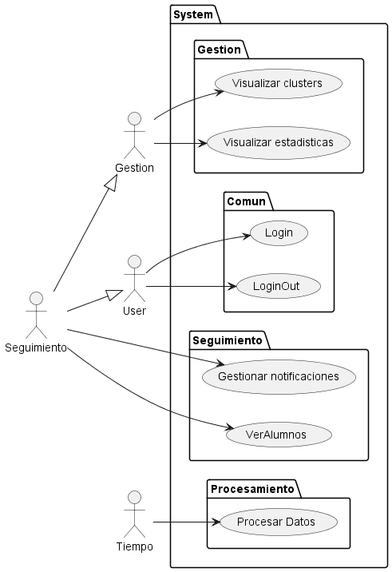
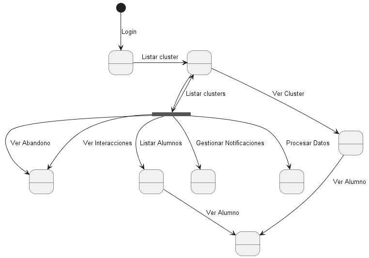

# Actores y Casos de uso

## Actores

| Actor           | Descripción                                                            |
| --------------- | ---------------------------------------------------------------------- |
| **Tiempo**      | Período en el que se procesan los datos                                |
| **Gestión**     | Vista general de clúster, interacciones y abandonos                    |
| **Seguimiento** | Encargado de gestionar notificaciones y vista detallada de los alumnos |

## Casos de Uso

|Casos de Uso 
|:-:
|
|[Código](CasosDeUso.puml)

## Diagrama de contexto

|Diagrama de contexto
|:-:
|
|[Código](diagramaContexto.puml)

[Atrás](../readme.md)
