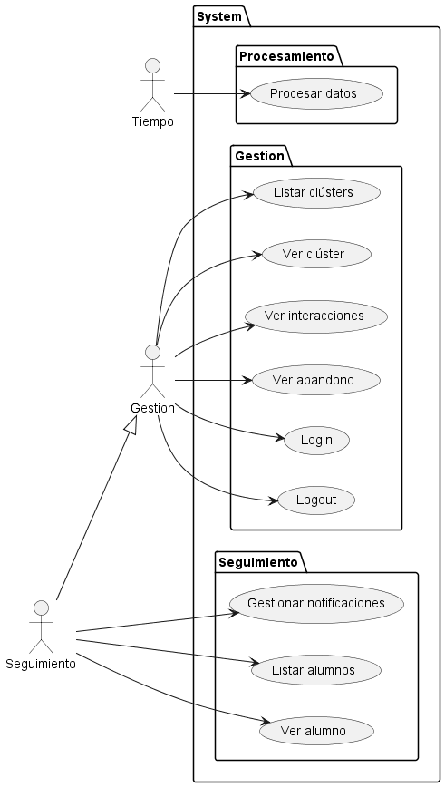

# Actores y Casos de uso

## Actores

| Actor                      | Descripción                                                                   |
| -------------------------- | ----------------------------------------------------------------------------- |
| **Alumnos Interactuando**  | El alumno interactúa con la plataforma o el sistema de gestión y genera datos |
| **Procesamiento Datos**    | Se procesan los datos generados por los alumnos                               |
| **Alumno Bajo Engagement** | Alumno con baja interacción y compromiso                                      |
| **Alumno Alto Engagement** | Alumno con alta interacción y compromiso                                      |
| **Abandono**               | Alumno deja la institución                                                    |

## Casos de Uso

|Casos de Uso 
|:-:
|
|[Código](CasosDeUso.puml)

## Diagrama de contexto

|Diagrama de contexto
|:-:
|
|[Código](diagramaContexto.puml)

[Atrás](../readme.md)