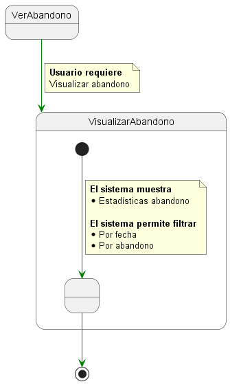
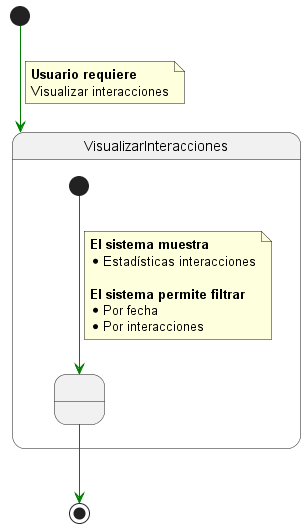

# Detalle casos de uso

  
Solicitar datos

|Solicitar datos
|:-:
|

  
Procesar datos

|Procesar datos
|:-:
|

  
Interpretar datos

|Interpretar datos
|:-:
|

  
Almacenar datos

|Almacenar datos
|:-:
|

  
Listar alumnos

  
|Listar alumnos
|:-:
|

  
Ver alumno

  
|Ver alumno
|:-:
|

  
Listar clústers

  
|Listar clústers
|:-:
|

  
Ver clúster

  
|Ver clúster
|:-:
|

  
Ver abandono

  
|Ver abandono
|:-:
|

  
Ver interacciones

  
|Ver interacciones
|:-:
|

  
Gestionar notificaciones

|Gestionar notificaciones
|:-:
|

[Atrás](../readme.md)