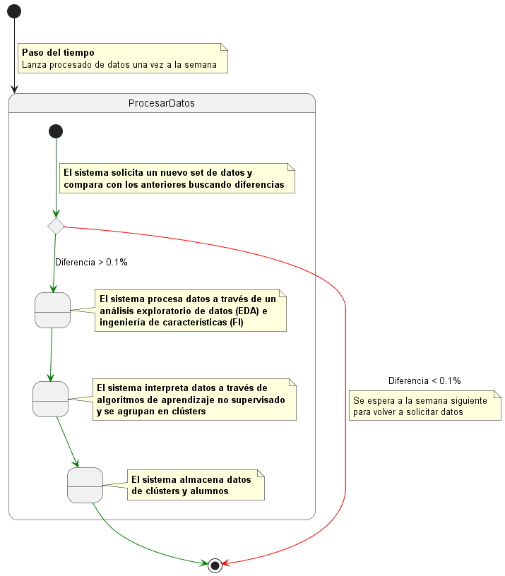
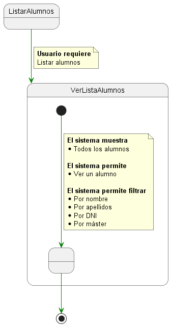

# Detalle casos de uso

  
Procesar datos

|Procesar datos
|:-:
|

  
Listar alumnos

  
|Listar alumnos
|:-:
|

  
Ver alumno

  
|Ver alumno
|:-:
|

  
Listar clústers

  
|Listar clústers
|:-:
|

  
Ver clúster

  
|Ver clúster
|:-:
|

  
Ver abandono

  
|Ver abandono
|:-:
|

  
Ver interacciones

  
|Ver interacciones
|:-:
|

  
Gestionar notificaciones

|Gestionar notificaciones
|:-:
|

## Glosario

| Término                           | Descripción                                                                                             |
| ------------------------------- | ------------------------------------------------------------------------------------------------------- |
| **Análisis exploratorio de datos (EDA)**                      | El análisis exploratorio de datos (EDA) es utilizado por los científicos de datos para analizar e investigar conjuntos de datos y resumir sus principales características, empleando a menudo métodos de visualización de datos.                                                             |
| **Ingeniería de características (FI)**                      | La ingeniería de características implica la extracción y transformación de variables a partir de datos sin procesar, como las listas de precios, las descripciones de los productos y los volúmenes de ventas, de modo que sea posible utilizar las características para el entrenamiento y la predicción.                                                                      |

[Atrás](../readme.md)