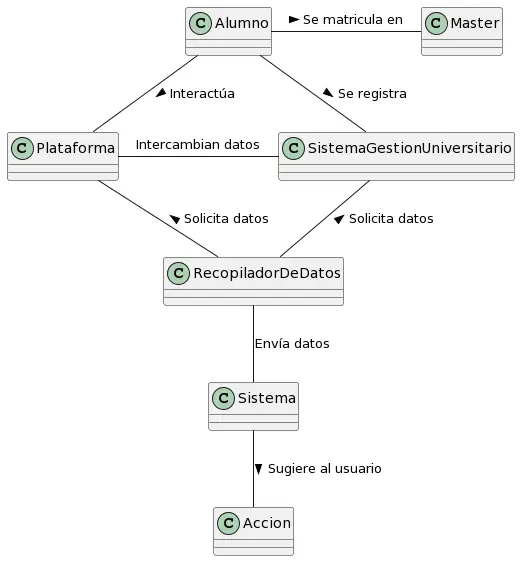
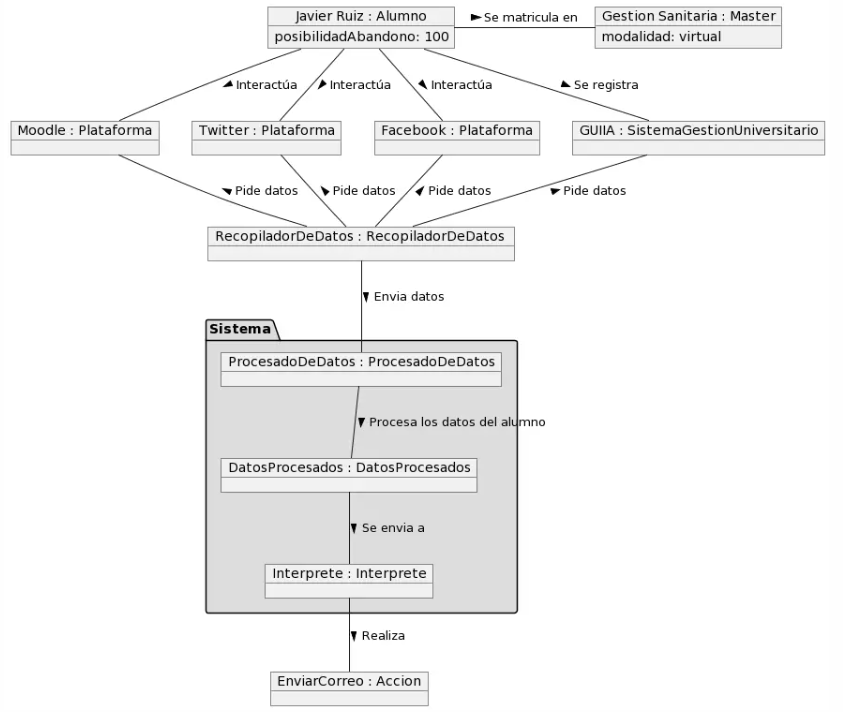
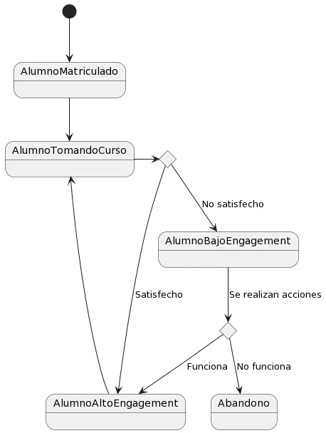

## Glosario

| Clase                           | Descripción                                                                                               |
| ------------------------------- | --------------------------------------------------------------------------------------------------------- |
| **Alumno**                      | Estudiante que cursa un máster.                                                                           |
| **Máster**                      | Titulación académica impartida por una universidad                                                        |
| **Plataforma**                  | Página con la que los alumnos interaccionan.                                                              |
| **SistemaGestionUniversitario** | Plataforma administrativa de la universidad en la que se registran los alumnos                            |
| **ProcesadoDeDatos**            | Recibe los datos de la plataforma y sistema de gestión y los normaliza                                    |
| **DatosProcesados**             | Datos resultantes del procesado de datos.                                                                 |
| **Intérprete**                  | Analiza los datos procesados y saca conclusiones de estos.                                                |
| **Acción**                      | Realiza acciones que el intérprete ha ofrecido como enviar una notificación, reunirse con el alumno, etc. |
| **Clúster**                     | Conjunto de alumnos que tienen características comunes                                                    |

## Diagramas

  
Diagrama de clases

  
|Diagrama de clases
|:-:
|

  
Diagrama de objetos

  
|Diagrama de objetos
|:-:
|

  
Diagrama de estados

  

| Estado                     | Descripción                                                                   |
| -------------------------- | ----------------------------------------------------------------------------- |
| **Alumnos Interactuando**  | El alumno interactúa con la plataforma o el sistema de gestión y genera datos |
| **Procesamiento Datos**    | Se procesan los datos generados por los alumnos                               |
| **Alumno Bajo Engagement** | Alumno con baja interacción y compromiso                                      |
| **Alumno Alto Engagement** | Alumno con alta interacción y compromiso                                      |
| **Abandono**               | Alumno deja la institución                                                    |

  
|Diagrama de estados alumno
|:-:
|

|Diagrama de estados sistema
|:-:
|

[Atrás](../readme.md)
