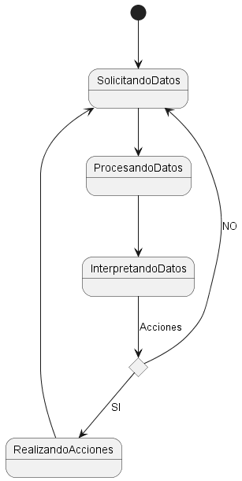

## Glosario

| Clase                           | Descripción                                                                                             |
| ------------------------------- | ------------------------------------------------------------------------------------------------------- |
| **Alumno**                      | Estudiante que cursa un máster.                                                                         |
| **Máster**                      | Titulación académica impartida por una universidad                                                      |
| **Plataforma**                  | Página con la que los alumnos interaccionan.                                                            |
| **SistemaGestionUniversitario** | Plataforma administrativa de la universidad en la que se registran los alumnos                          |
| **Sistema**                     | Representacion de la solucion desarrollada                                                              |
| **RecopiladorDeDatos**          | Entidad externa al sistema que recopila los datos de la plataforma y sistema de gestión y los normaliza |
| **ProcesadoDeDatos**            | Entidad que se encarga de solicitar datos al recopilador y procesarlos                                  |
| **Intérprete**                  | Analiza los datos procesados y saca conclusiones de estos.                                              |
| **Acción**                      | Realiza acciones que el intérprete ha ofrecido como enviar un correo, reunirse con el alumno, etc.      |
| **Clúster**                     | Conjunto de alumnos que tienen características comunes                                                  |

## Diagramas

  
Diagrama de clases

  
|         Diagrama de clases          |             Diagrama de sistema             |
| :---------------------------------: | :----------------------------------------: |
|  |  |

  
Diagrama de objetos

  
|Diagrama de objetos
|:-:
|

  
Diagrama de estados

  

| Estado                     | Descripción                                                                                           |
| -------------------------- | ----------------------------------------------------------------------------------------------------- |
| **Alumnos matriculado**    | El alumno esta matriculado en el máster                                                               |
| **Alumno tomando curso**   | El alumno toma el curso mientras pasa el tiempo                                                       |
| **Alumno bajo engagement** | Alumno con baja interacción y compromiso                                                              |
| **Alumno alto engagement** | Alumno con alta interacción y compromiso                                                              |
| **Abandono**               | Alumno deja la institución                                                                            |
| **Solicitando datos**      | Sistema solicitando datos de alumnos                                                                  |
| **Procesando datos**       | Sistema procesando los datos de los alumnos                                                              |
| **Interpretando datos**    | Sistema interpretando los datos procesados y agrupándolos en clústers                                    |
| **Realizando acciones**    | Sistema realizando acciones para que el alumno no abandone, esto también puede realizarse fuera del sistema |

  
|             Diagrama de estados alumno              |             Diagrama de estados sistema              |
| :-------------------------------------------------: | :--------------------------------------------------: |
|  |  |

[Atrás](../readme.md)
