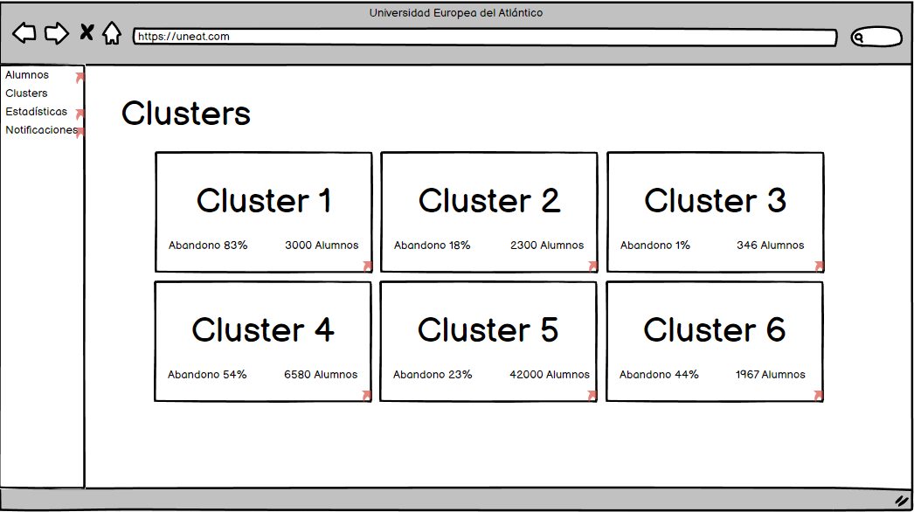
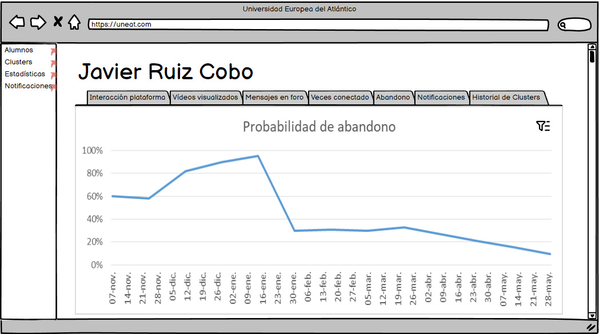
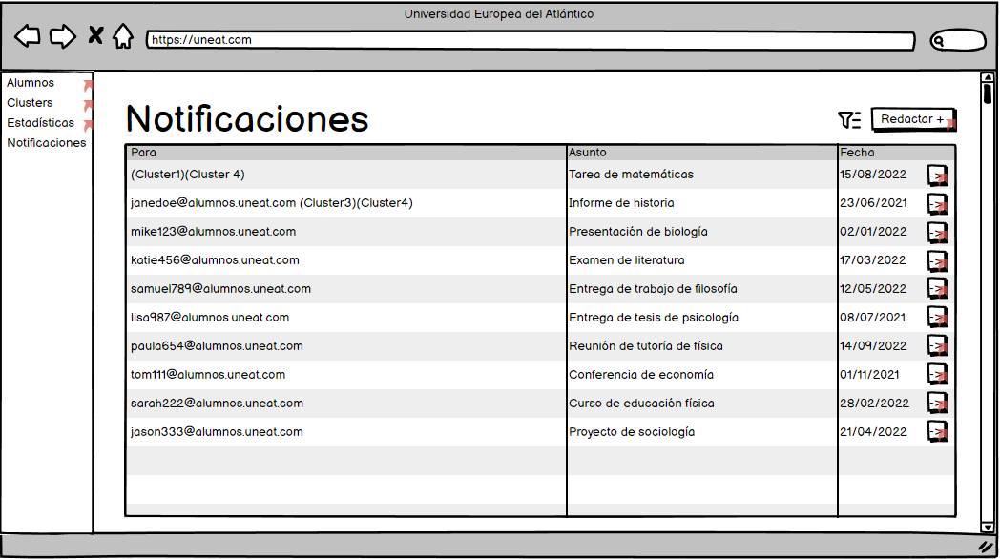
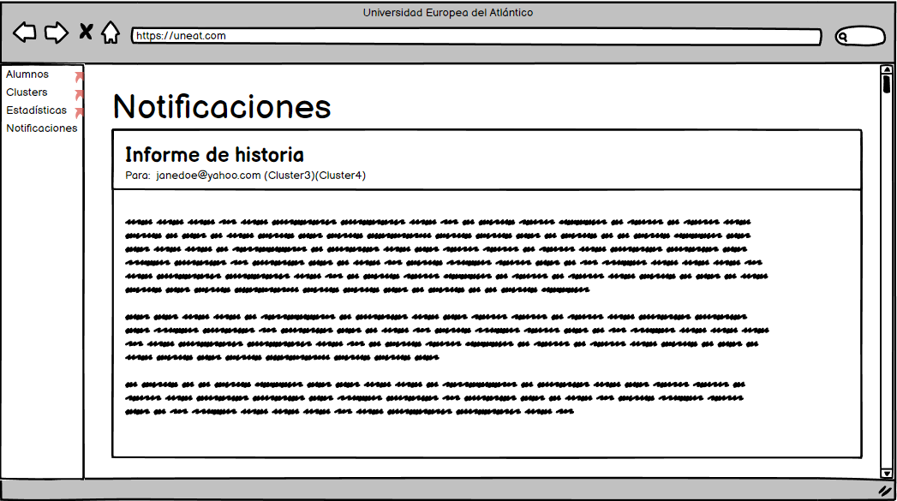
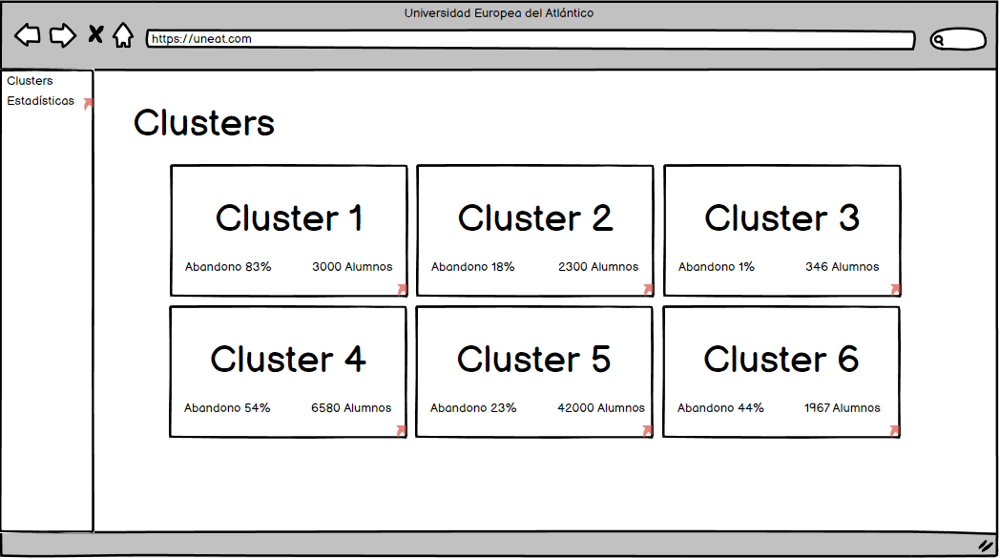
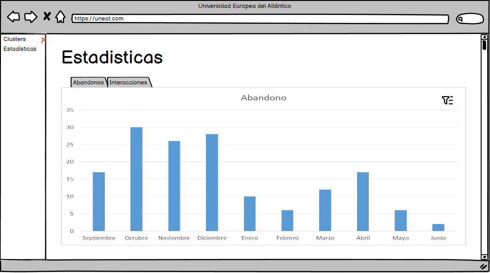

# Prototipo de interfaz

## Usuario Seguimiento

  
Login

|Kogin
|:-:
|

  
Lista clústers

|Listar clústers
|:-:
|

  
Ver clúster

|Ver clúster
|:-:
|

  
Gestión alumnos

|Gestión alumnos
|:-:
|

  
Información de alumno

|Información de alumno
|:-:
|

  
Estadísticas

|Estadísticas
|:-:
|

  
Ver notificaciones

|Ver notificaciones
|:-:
|

  
Ver notificación

|Ver notificación
|:-:
|

  
Enviar notificación

|Enviar notificación
|:-:
|

## Usuario Gestión

  
Login

|Login
|:-:
|

  
Lista clústers

|Listar clústers
|:-:
|

  
Ver clúster

|Ver clúster
|:-:
|

  
Estadísticas

|Estadísticas
|:-:
|

[Atrás](../readme.md)