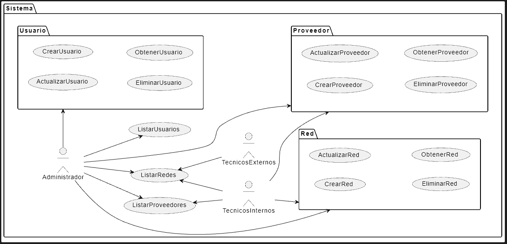
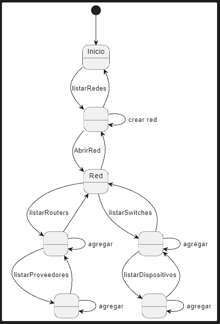

# Actores y casos de uso

## Actores

|Actor|Descripción|
|-|-|
|**Administrador**|Gestiona redes, proveedores y usuarios|
|**Técnicos internos**|Gestionan redes y proveedores|
|**Técnicos externos**|Ven redes|

## Casos de uso

|Casos de Uso|
|:-:|
||
|[Código](./casosDeUso/casosDeUso.plantuml)|

## Diagrama de contexto

|Diagrama de contexto|
|:-:|
||
|[Código](./diagramaDeContexto/diagramaDeContexto.plantuml)|

