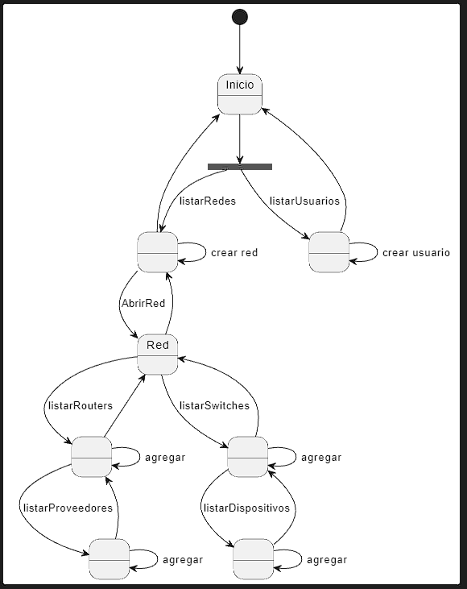

# App Redes

|Modelo de dominio|
|:-:|
||
|[Código del modelo](./modeloDeDominio/proyectoV1.plantuml)|

 

|Diagrama de objetos|
|:-:|
||
|[Código del diagrama](./diagramaDeObjetos/proyecto.plantuml)|

 

|Diagrama de estados|
|:-:|
||
|[Código del diagrama](./diagramaDeEstados/proyecto.plantuml)|

