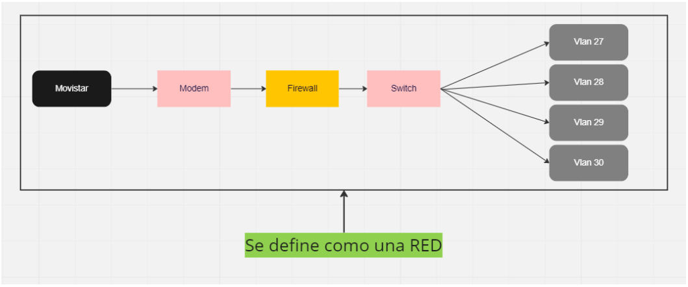
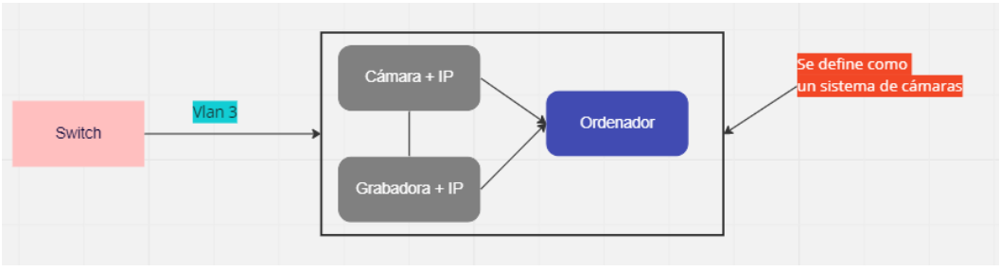

# App Redes
El objetivo de ésta aplicación es el de gestionar redes, que permita ver el estado de las partes que componen una red y notificar al administrador si hay algún fallo.

Las partes que componen una red son, proveedor, red, seguridad, switch y dispositivos:
| |
|-|
||

 

Al `switch` se le pueden agregar varios dispositivos, uno de ellos es un sistema, un sistema es un conjunto de dispositivos:

| |
|-|
||

|Readme|Readme|
|-|-|
|[Ver diagramas](./diagramas/readme.md)  |  [Ver actores y casos de uso](./casos/readme.md)|

