# Aplicación gestión viajes
1. [Introducción](#Introducción)
2. [Diagrama de clases](#Diagrama-de-clases)
3. [Diagrama de objetos](#Diagrama-de-objetos)
4. [Diagrama de estados](#Diagrama-de-estados)
5. [Casos de usos](#Casos-de-usos)

## Introduction
El cliente requiere una solución informática que pueda facilitar la gestión de las solicitudes de viaje y los viajes por parte de los profesores al ser invitado o ser partícipe de algún evento. Por lo tanto expresa que necesita de qué administración tenga esta solución para poder buscar vuelos, hoteles y recogida de tickets (si es que proporcionan dinero para dicho viaje). La solución necesita tener:

1. Una calendarización de cuantos días el profesor irá de viaje
2. Lista de necesidades proporcionadas por el profesor (auto, avión, estancia, comida, etc)
3. Dieta (dinero que no necesita ser justificado)
4. Recorrido de la Universidad al destino
5. Estado de la solicitud del viaje
6. Formulario de solicitud de viaje con adjunto de archivo de invitación (si este es digital)
7. Subida de foto de tickets para constatar en que se ha gastado el dinero
8. Datos personales (formulario)
9. Comentarios en las fotos de los tickets subidos
10. Control de cobros
### Glosario
| Término  | Definición |
| ------------- | ------------- |
| Trabajador  | Persona que trabaja en la universidad y que tiene derecho a viajes  |
| Gestion  | Gestión académica que se encarga de realizar las gestiones de la universidad  |
| Gastos  | El conjunto de costes que se generan cuando un trabajador de una empresa debe desplazarse a otro lugar, diferente al de su centro de trabajo habitual, para llevar a cabo su trabajo y realizar sus tareas profesionales  |
| Justificante  | Documento, suele ser un ticket, que valida el gasto realizado  |
| Registro  | Resumen del viaje con los datos generados  |
| Dieta  | Son las compensaciones económicas que satisfacen las empresas a sus trabajadores cuando estos se deben desplazar por motivo de trabajo  |
### Explicación solución
El problema planteado consiste en que un profesor, solicita un viaje en unas fechas, el cual es aceptado o denegado. Si es aceptado, se le entregará un formulario, el cual el profesor rellenará un formulario donde se le preguntará el medio de transporte que desea, si es en coche, elegirá entre privado o de la universidad, si es de la universidad deberá reservarlo en la web, después deberá introducir por Google Maps el destino y deberemos calcular la distancia desde la Universidad hasta el destino, si es en tren la estación desde donde desea salir y si es en avión, el aeropuerto que desee.Tras ello, deberá elegir si desea hotel o no, si necesitara dietas y fondos

Al final del formulario, podrá añadir en una caja de comentarios, sugerencias de hoteles (provistos por la organización del evento por ejemplo)
A partir de la finalización del viaje hasta que lo entregue, se le mandará un recordatorio de que debe entregar fotos de los tickets para justificar los gastos a administración y el coste de estos de manera manual, estos tickets serán validados automáticamente.
De esta manera, la administración tendría de manera más eficaz, las fechas, datos personales y autorización del viaje por parte del vicerrectorado y el resto de datos dados por el profesor, todo de manera automática. 

Una vez tienen todos los datos, organizaron el viaje, y al final de este, el profesor entregará los tickets de manera manual y se calculará si se le debe dar más de dietas o debe devolver a la universidad.

## Diagrama de clases

## Diagrama de objetos

## Diagrama de estados

## Casos de usos
### Actores
| Actor            | Descripción                                                                          |
|------------------|--------------------------------------------------------------------------------------|
| **Gestión**      | Validan el viaje, organizan el viaje y gestionan la provisión de fondos. 			         |
| **Trabajadores** | Solicitan viajar y viajan. 					                                                     |
| **Tiempo**       | Crea alerta a gestión si el viaje una vez finalizado no se ha gestionado los cobros. |
### Casos de usos

### Detalle casos de usos

    
Solicitar viaje

    El trabajador puede solicitar el viaje que desee. Esta petición vendrá con datos básicos, como fechas, lugar, carta de invitación si la hay.  
    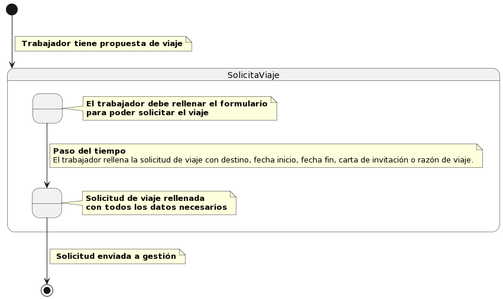</img>

    
Ver sus solicitudes

    El trabajador puede ver todas sus solicitudes pendientes.  
    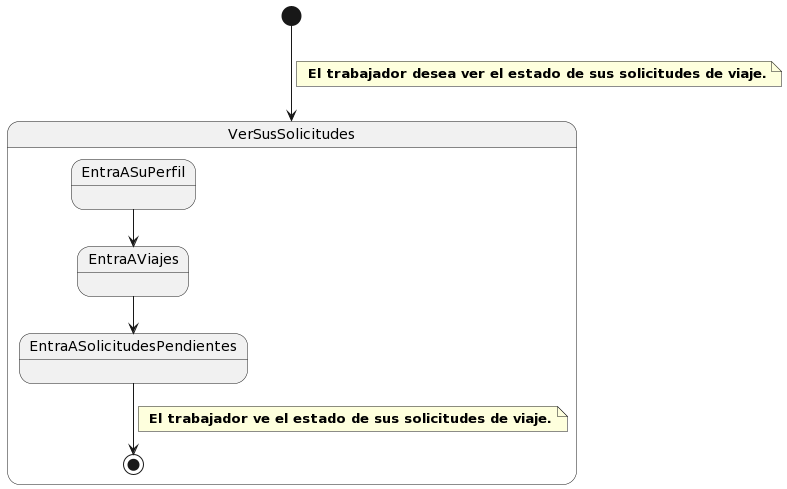</img>

    
Ver solicitudes pendientes

    La gestión podrá ver todas las solicitudes que aun no se han validado.  
    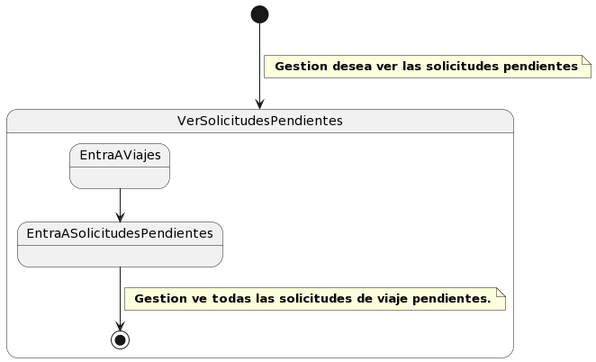</img>

    
Validar solicitud

    La gestión podrá aceptar o denegar las solicitudes pendientes de los viajes de los trabajadores.  
    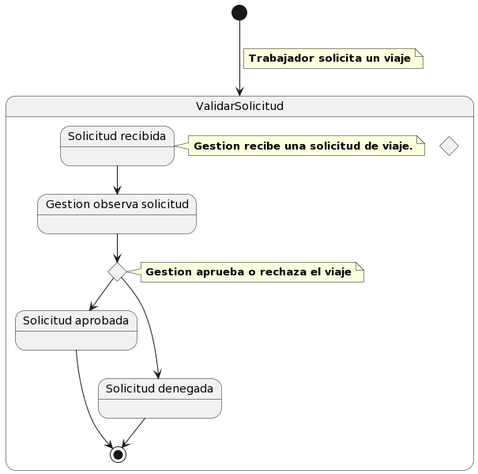</img>

    
Ver justificantes

    La gestión podrá ver todos los justificantes de un viaje.  
    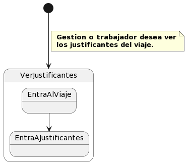</img>

    
Enviar justificante

    El trabajador podrá enviar fotos de los justificantes cuando esté viajando o una vez acabado el viaje.  
    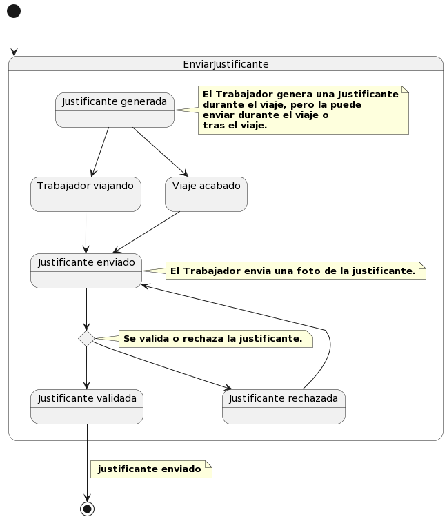</img>

    
Validar justificante

    Una vez recibido el justificante, la gestión tendrá que validarlo. Si es inválido se denegará anotando un comentario, que el profesor podrá leer. Si es válido se aceptará ys se anotará el importe.          
    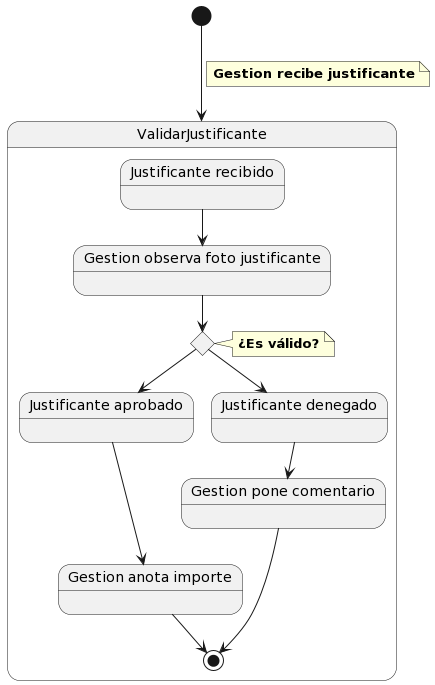</img>

    
Planificar viaje

    Una vez la solicitud haya sido aceptada, la gestión establecerá el transporte, alojamiento y las dietas al viaje.  
    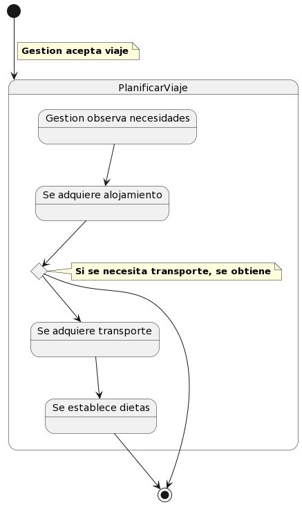</img>

    
Ver planificación viaje

    Una vez el viaje haya sido planificado por la gestión, el profesor podrá ver el transporte, alojamiento y dietas.  
    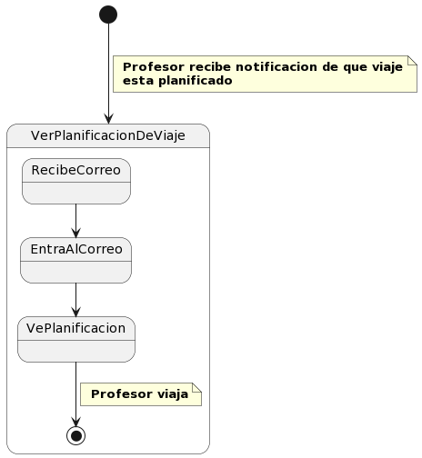</img>

    
Ver viajes

    La gestión podrá ver todos los viajes.  
    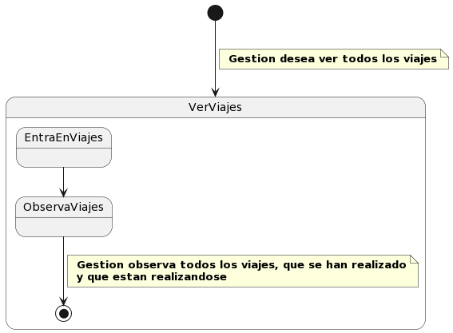</img>

    
Crear Informe

    La gestión podrá crear un informe del viaje.  
    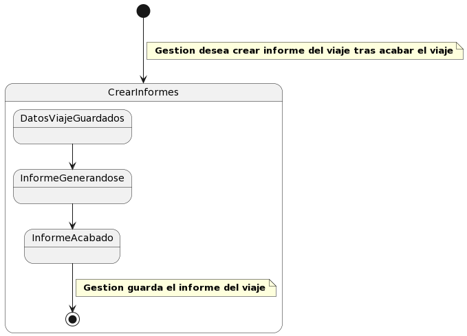</img>

    
Calcular cobros necesarios

    Este caso de uso se ejecutará automáticamente cada X tiempo, es una tarea en segundo plano. Calculará todos los gastos de un viaje acabados y lo compara con los fondos para saber si la universidad debe dinero al trabajador o al revés.  
    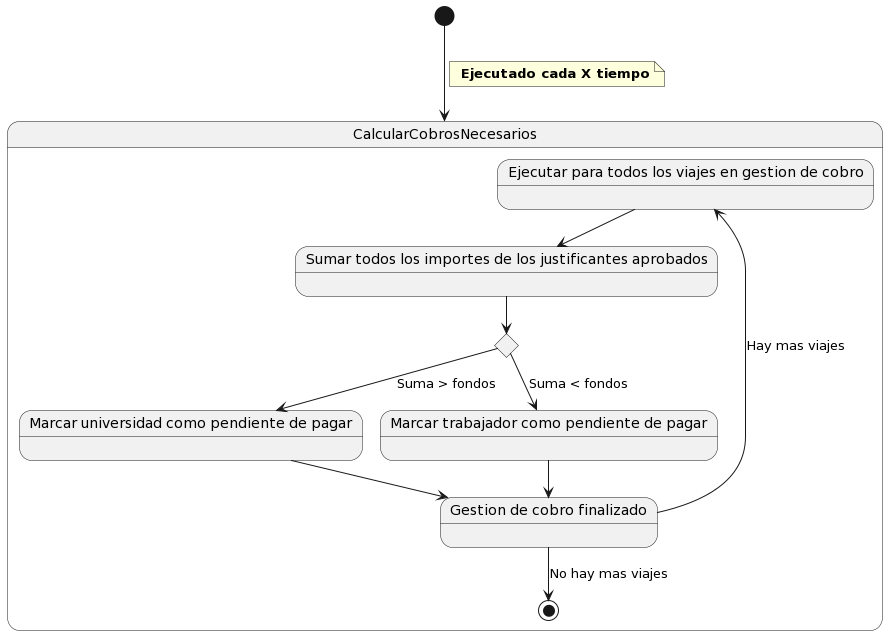</img>

    
Comprobar gestión de cobros penddientes

    Este caso de uso se ejecutará automáticamente cada X tiempo, es una tarea en segundo plano. Si un viaje no se han gestionado los cobros en un tiempo límite, este caso de uso generará una alerta que le llegará a gestión.  
    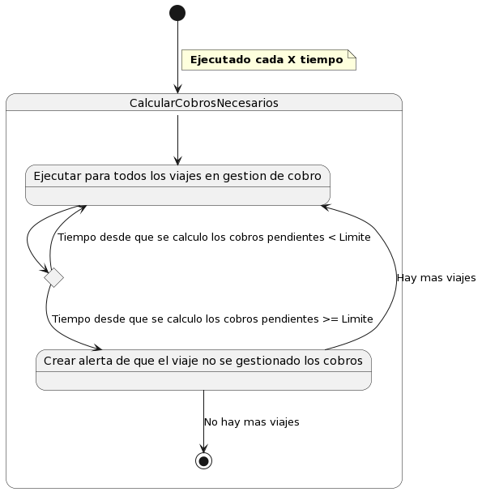</img>

## Interfaz
### Gestion
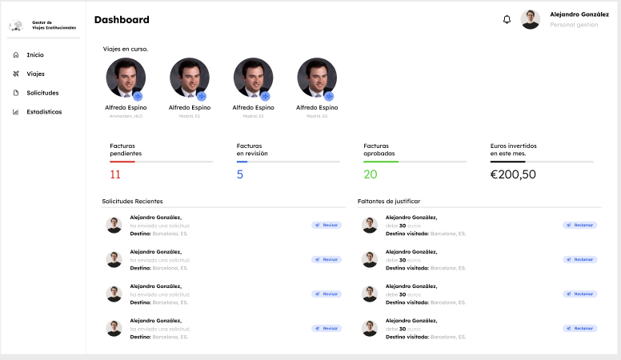
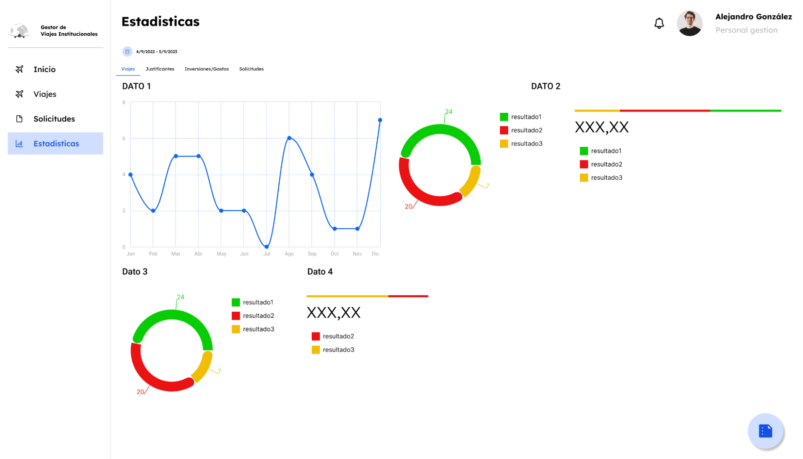
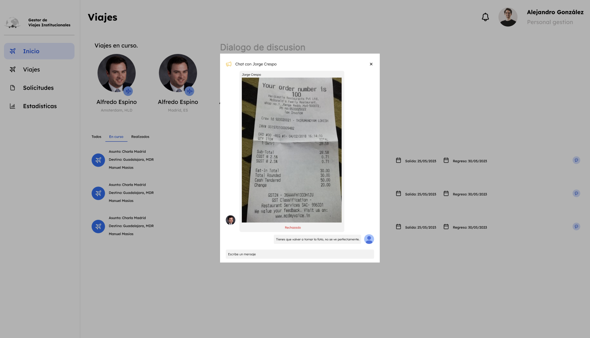
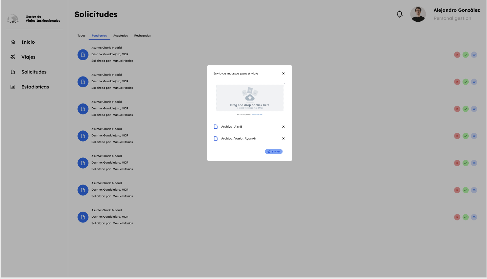
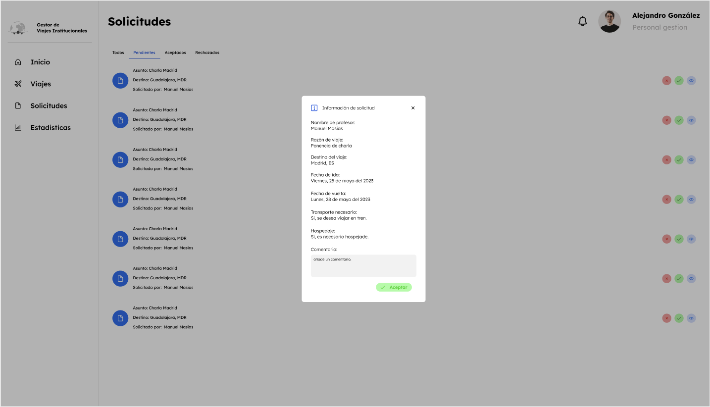
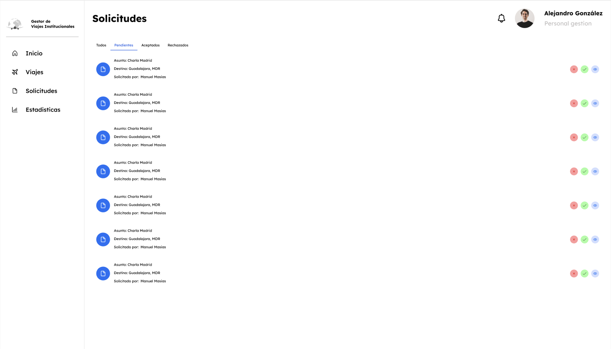
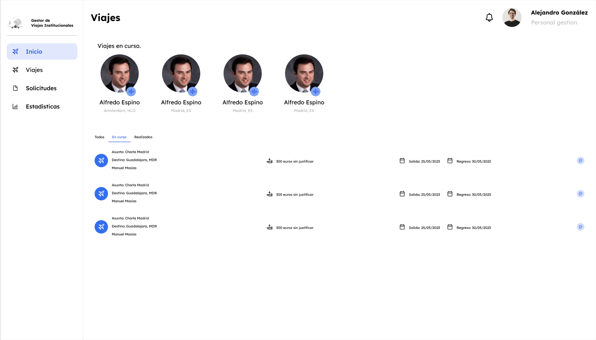

### Trabajadores
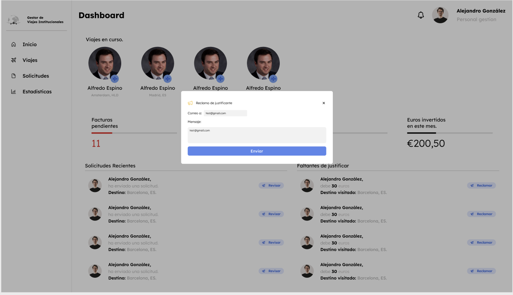
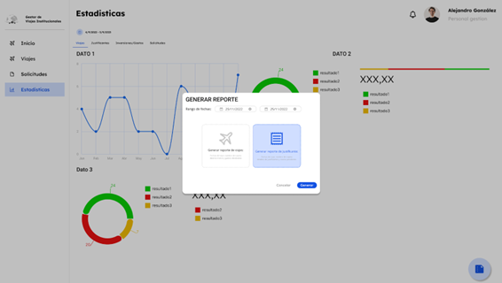
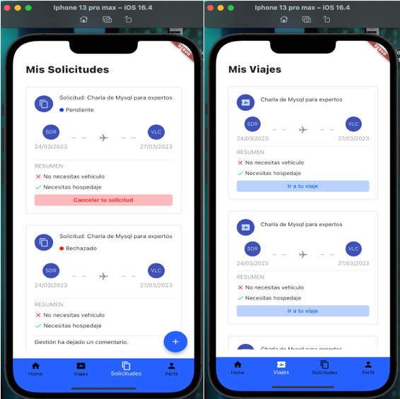
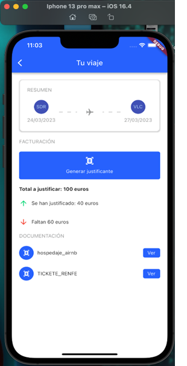
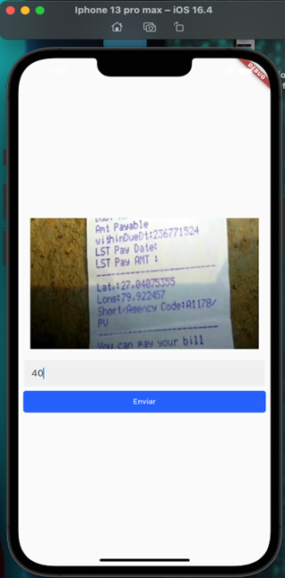
