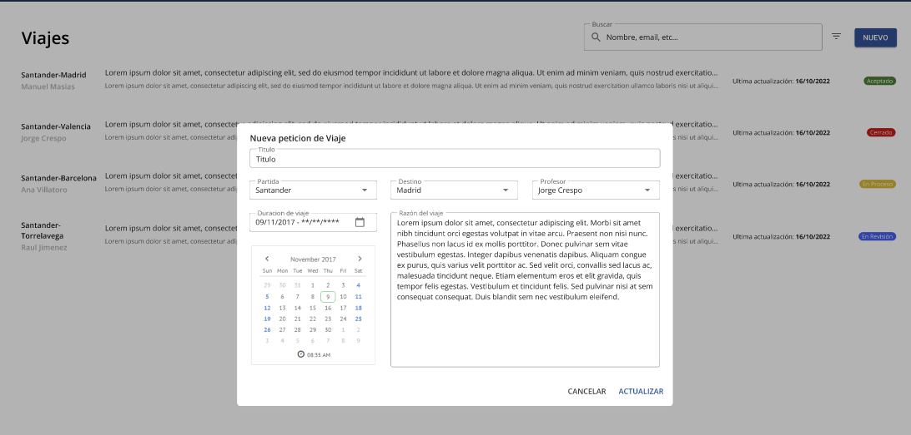
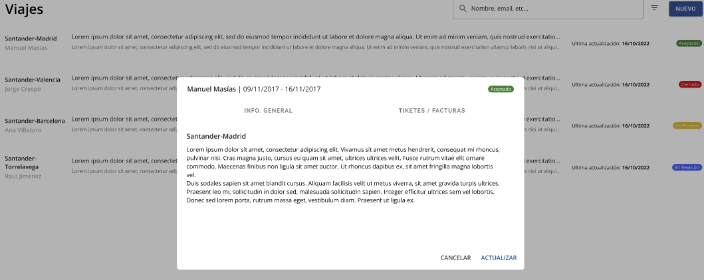
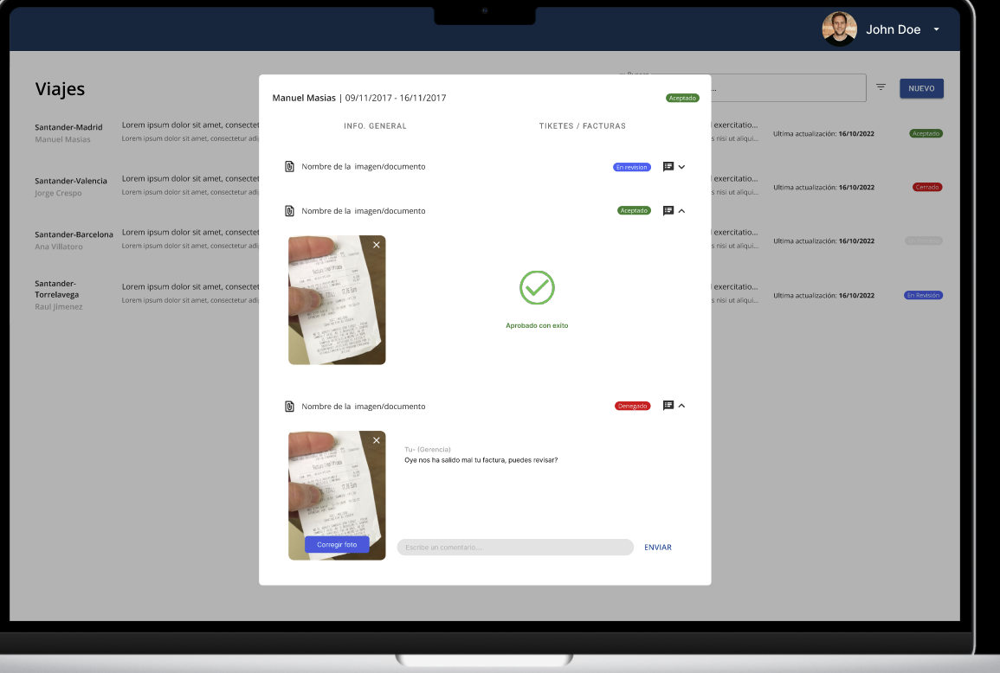
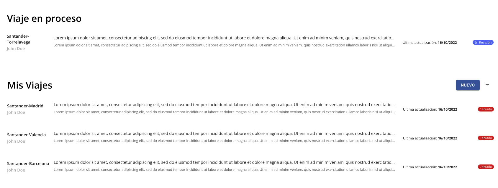
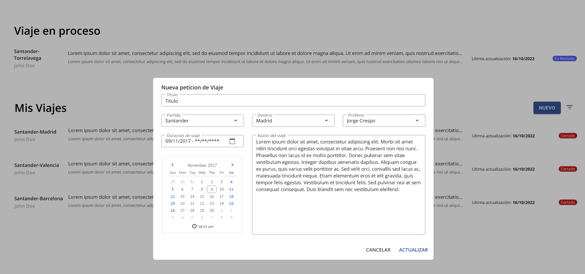
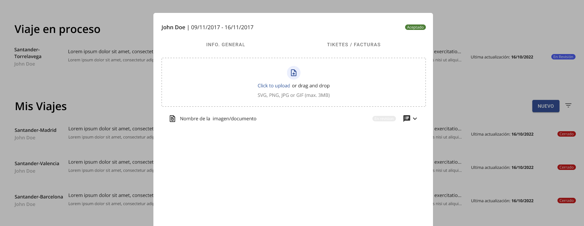
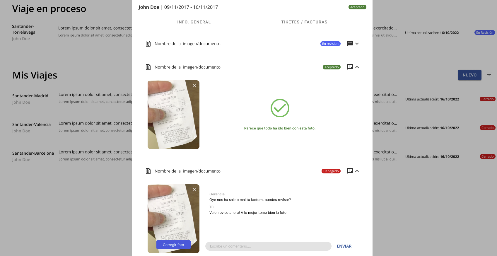

# Aplicación gestión viajes
1. [Introducción](#Introducción)
2. [Diagrama de clases](#Diagrama-de-clases)
3. [Diagrama de objetos](#Diagrama-de-objetos)
4. [Diagrama de estados](#Diagrama-de-estados)
5. [Casos de usos](#Casos-de-usos)

## Introduccion
El cliente requiere una solución informática que pueda facilitar la gestión de las solicitudes de viaje y los viajes por parte de los profesores al ser invitado o ser participe de algún evento. Por lo tanto expresa que necesita de qué administración tenga esta solución para poder buscar vuelos, hoteles y recogida de tickets (si es que proporcionan dinero para dicho viaje). La solución necesita tener:

1. Una calendarización de cuantos días el profesor irá de viaje
2. Lista de necesidades proporcionados por el profesor (auto, avión, estancia, comida, etc)
3. Dieta (dinero que no necesita ser justificado)
4. Recorrido de la Universidad al destino
5. Estado de la solicitud del viaje
6. Formulario de solicitud de viaje con adjunto de archivo de invitación (si este es digital)
7. Subida de foto de tickets para constatar en que se ha gastado el dinero
8. Datos personales (formulario)
9. Comentarios en las fotos de los tickets subidos

### Explicación solución
El problema planteado, consiste en que un profesor, solicita un viaje en unas fechas, el cual es aceptado o denegado. Si es aceptado, se le entregará un formulario, el cual el profesor rellenará un formulario donde se le preguntará el medio de transporte que desea, si es en coche, elegirá entre privado o de la universidad, si es de la universidad deberá reservarlo en la web, después deberá introducir por Google Maps el destino y deberemos calcular la distancia desde la Universidad hasta el destino, si es en tren la estación desde donde desea salir y si es en avión, el aeropuerto que desee.Tras ello, deberá elegir si desea hotel o no, si necesitara dietas y fondos

Al final del formulario, podrá añadir en una caja de comentarios, sugerencias de hoteles (provistos por la organización del evento por ejemplo)
A partir de la finalización del viaje hasta que lo entregue, se le mandará un recordatorio de que debe entregar fotos de los tickets para justificar los gastos a administración y el coste de estos de manera manual, estos tickets serán validados automáticamente.
De esta manera, la administración tendría de manera más eficaz, las fechas, datos personales y autorización del viaje por parte del vicerrectorado y el resto de datos dados por el profesor, todo de manera automática. 

Una vez tienen todos los datos, organizaron el viaje, y al final de este, el profesor entregará los tickets de manera manual y se calculará si se le debe dar más de dietas o debe devolver a la universidad.

## Diagrama de clases

## Diagrama de objetos

## Diagrama de estados

## Casos de usos
### Actores
| Actor                      | Descripción                                                                   |
| -------------------------- | ----------------------------------------------------------------------------- |
| **Gestión académica**      | Organizan el viaje y gestionan la provisión de fondos. 			     |
| **Profesores**             | Solicitan viajar y viajan. 					             |
| **Vicerrectorado**         | Aceptan y deniegan solicitudes de viajes.   				     |

### Casos de usos

### Explicacion casos de usos

##### Gestión Académica

<ul>
    <li>**Planificar viaje** Una vez el profesor haya rellenado el formulario con las necesidades. La gestión asignará al viaje las reservas del hotel, el transporte etc.</li>
    <li>**Ver viajes aceptados** La gestión podrá ver todos los viajes que hayan sido aceptados y que el formulario con las necesidades haya sido rellenado.</li>
    <li>**Ver facturas recibidas** La gestión podrá ver todos las facturas enviadas por el profesor que esté viajando o haya viajado.</li>
    <li>**Aprovisionar fondos** La gestión podrá establecer fondos para el viaje incluido para las dietas.</li>
    <li>**Enviar facturas** El profesor cuando esté viajando, podrá enviar fotos de las facturas del viaje.</li>
    <li>**Ver planificación del viaje** El profesor podrá ver todos los datos de las reservas, transportes establecidos por la gestión.</li>
</ul>

#### Profesor
<ul>
    <li>**Solicitar viaje** El profesor puede solicitar el viaje que desee. Esta petición, vendrá con datos básicos, como fechas, lugar, carta de invitación si la hay.</li>
    <li>**Rellenar necesidades** Una vez el viaje haya sido aceptado, el profesor rellena una serie de necesidades que se le solicita. Como tipo de transporte, lugar de hospedaje si hay (por ejemplo si tiene familia) etc.</li>
    <li>**Ver sus solicitudes** En este caso de uso, el profesor puede acceder al estado de sus solicitudes. Aceptada/Denegada/Pendiente/Pendiente de organización…</li>
</ul>

#### Vicerrectorado
<ul>
    <li>**Aceptar/Denegar solicitud** En este caso de uso, los miembros del vicerrectorado, encargados de aceptar/denegar los viajes, tendrán la opción de ello, dependiendo del tipo de viaje que se solicita</li>
    <li>**Ver solicitudes pendientes** Los miembros del vicerrectorado, podrían entrar a un buzón, donde se encontrarán todas las solicitudes pendientes de aceptación o denegación de viaje.</li>
</ul>

## Interfaz
### Administración académica

### Trabajadores

