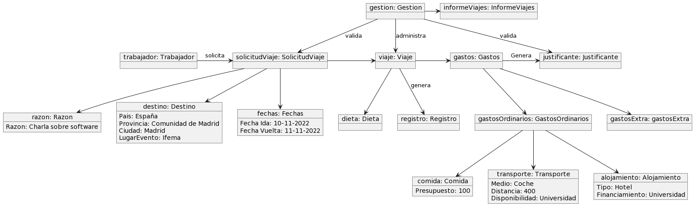
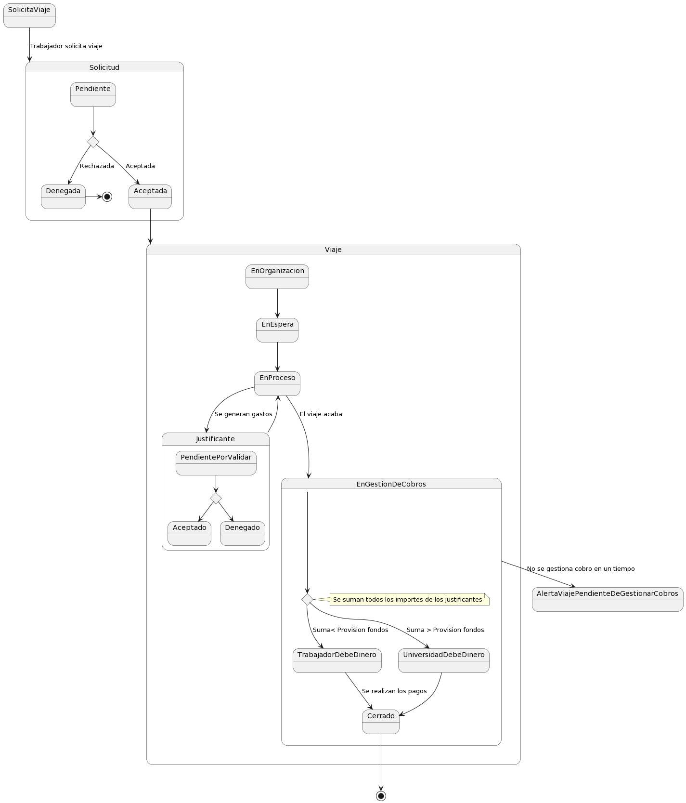

# Aplicacion gestion viajes
1. [Introduccion](#Introduccion)
2. [Diagrama de clases](#Diagrama-de-clases)
3. [Diagrama de objetos](#Diagrama-de-objetos)
4. [Diagrama de estados](#Diagrama-de-estados)
5. [Casos de usos](#Casos-de-usos)

## Introduccion
El cliente requiere una solución informática que pueda facilitar la gestión de las solicitudes de viaje y los viajes por parte de los profesores al ser invitado o ser participe de algún evento
## Diagrama de clases

## Diagrama de objetos

## Diagrama de estados

## Casos de usos
### Actores
| Actor                      | Descripción                                                                   |
| -------------------------- | ----------------------------------------------------------------------------- |
| **Gestión académica**      | Organizan el viaje y gestionan la provisión de fondos. 			     |
| **Profesores**             | Solicitan viajar y viajan. 					             |
| **Vicerrectorado**         | Aceptan y deniegan solicitudes de viajes.   				     |

### Casos de usos

