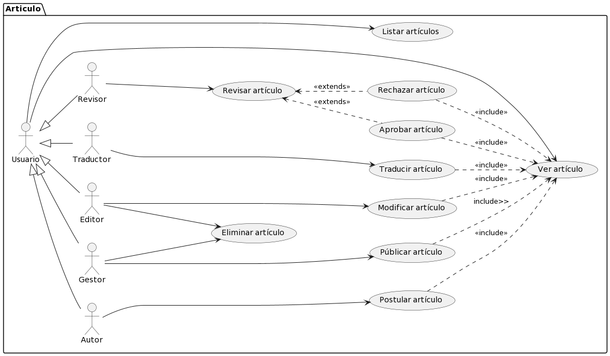
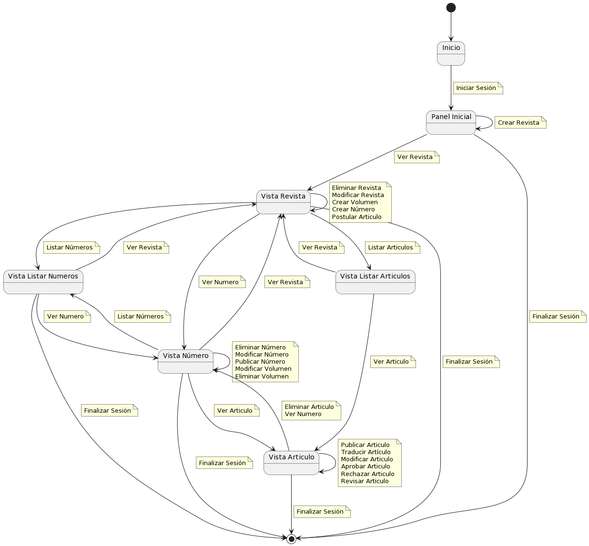
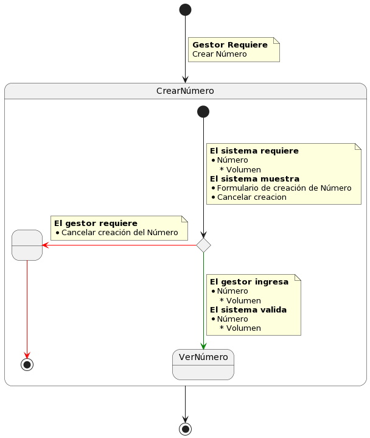
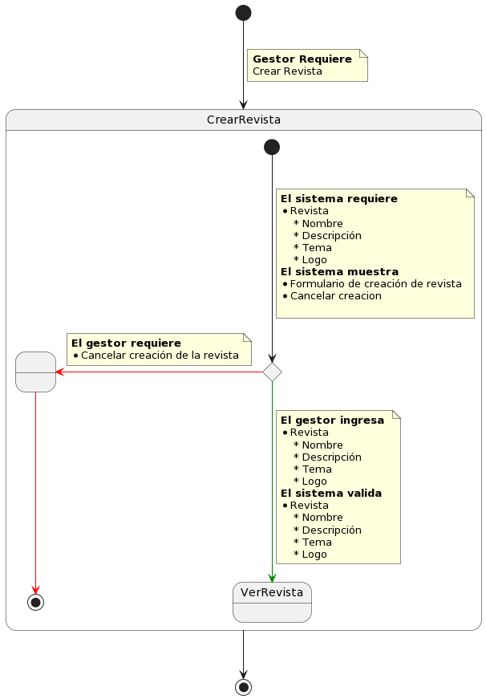

# Actores y Casos de uso

## Encontrar actores y casos de uso 

Se han identificado 6 actores y 24 casos de uso y se han clasificado en casos de uso relacionados con Sesión, Revista, Artículo, Volumen, Número.

### Actores

| Actor         | Descripción                                                                     |
| ------------- | ------------------------------------------------------------------------------- |
| **Usuario**   | Persona registrada con cualquier tipo de rol de los permitidos por el programa. |
| **Gestor**    | Usuario con capacidades de gestión y moderación de la editorial y revistas.     |
| **Autor**     | Usuario que postula un artículo para su publicación.                            |
| **Traductor** | Usuario que puede traducir los artículos a castellano, inglés o portugués.      |
| **Revisor**   | Usuario que determina si un artículo postulado podrá ser publicado o no.        |
| **Editor**    | Usuario que da formato al artículo postulado una vez que ha sido aprobado.      |

### Casos de uso Identificados

|                   |                    |                   |
| ----------------- | ------------------ | ----------------- |
| Iniciar sesión    | Finalizar sesión   | Postular artículo |
| Publicar artículo | Modificar artículo | Eliminar artículo |
| Aprobar artículo  | Rechazar artículo  | Revisar artículo  |
| Traducir artículo | Ver artículo       | Modificar Volumen |
| Eliminar Volumen  | Crear Volumen      | Listar Números    |
| Modificar número  | Eliminar número    | Publicar número   |
| Crear número      | Ver Numero         | Ver Revista       |
| Eliminar Revista  | Modificar Revista  | Crear Revista     |

### Casos de Uso Por paquetes

  
Artículo

  

 
[Código](EncontrarCasosDeUso/articulo.puml)  

  
Número

  

 
[Código](EncontrarCasosDeUso/numero.puml)  

  
Volúmen

  

 
[Código](EncontrarCasosDeUso/volumen.puml)  

  
Revista

  

 
[Código](EncontrarCasosDeUso/revista.puml)  

  
Sesión

  

 
[Código](EncontrarCasosDeUso/sesion.puml) 

### Diagrama de contexto

|Diagrama de contexto
|:-:
|
|[Código](EncontrarCasosDeUso/DiagramaDeContexto.puml)

## Priorizar Casos de Uso

1. Artículo
2. Número
3. Volumen
4. Revista
5. Sesión

## Detallar Casos de Uso

  
Paquete Artículo

  

    
Ver Artículo

    
  
   
  [Código](DetallarCasosDeUso/VerArticulo.puml) 

  

  

    
Revisar Artículo

    
  
   
  [Código](DetallarCasosDeUso/RevisarArticulo.puml) 

  

  

    
Rechazar Artículo

    
  
   
  [Código](DetallarCasosDeUso/RechazarArticulo.puml) 

  

  

    
Aprobar Artículo

    
  
   
  [Código](DetallarCasosDeUso/AprobarArticulo.puml) 

  

  

    
Traducir Artículo

    
  
   
  [Código](DetallarCasosDeUso/TraducirArticulo.puml) 

  

  

    
Modificar Articulo

    
  
   
  [Código](DetallarCasosDeUso/ModificarArticulo.puml) 

  

  

    
Eliminar Artículo

    
  
   
  [Código](DetallarCasosDeUso/EliminarArticulo.puml) 

  

  

    
Publicar Artículo

    
  
   
  [Código](DetallarCasosDeUso/PublicarArticulo.puml) 

  

  

    
Postular Artículo

    
  
   
  [Código](DetallarCasosDeUso/PostularArticulo.puml) 

  

 

  
Paquete Número

  

    
Ver Número

    
  
   
  [Código](DetallarCasosDeUso/VerNumero.puml) 

  

  

    
Listar Números

    
  
   
  [Código](DetallarCasosDeUso/ListarNumeros.puml) 

  

  

    
Publicar número

    
  
   
  [Código](DetallarCasosDeUso/PublicarNumero.puml) 

  

  

    
Eliminar Número

    
  
   
  [Código](DetallarCasosDeUso/EliminarNumero.puml) 

  

  

    
Modificar Número

    
  
   
  [Código](DetallarCasosDeUso/ModificarNumero.puml) 

  

  

    
Crear Número

    
  
   
  [Código](DetallarCasosDeUso/CrearNumero.puml) 

  

 

  
Paquete Volumen

  

  
Eliminar Volumen

  
  
   
  [Código](DetallarCasosDeUso/EliminarVolumen.puml) 

  

  

    
Modificar Volumen

    
  
   
  [Código](DetallarCasosDeUso/ModificarVolumen.puml) 

  

  

    
Crear Volumen

    
  
   
  [Código](DetallarCasosDeUso/CrearVolumen.puml) 

  

 

  
Paquete Revista

  

    
Leer Revista

    
  
   
  [Código](DetallarCasosDeUso/LeerRevista.puml) 

  

  

    
Crear Revista

    
  
   
  [Código](DetallarCasosDeUso/CrearRevista.puml) 

  

  

    
Modificar Revista

    
  
   
  [Código](DetallarCasosDeUso/ModificarRevista.puml) 

  

  

    
Eliminar Revista

    
  
   
  [Código](DetallarCasosDeUso/EliminarRevista.puml) 

  

  

 

  
Paquete Sesión

  

    
Iniciar Sesión

    
  
   
  [Código](DetallarCasosDeUso/IniciarSesion.puml) 

  

  

    
Finalizar Sesión

    
  
   
  [Código](DetallarCasosDeUso/FinalizarSesion.puml) 

  

[Atrás](../readme.md)