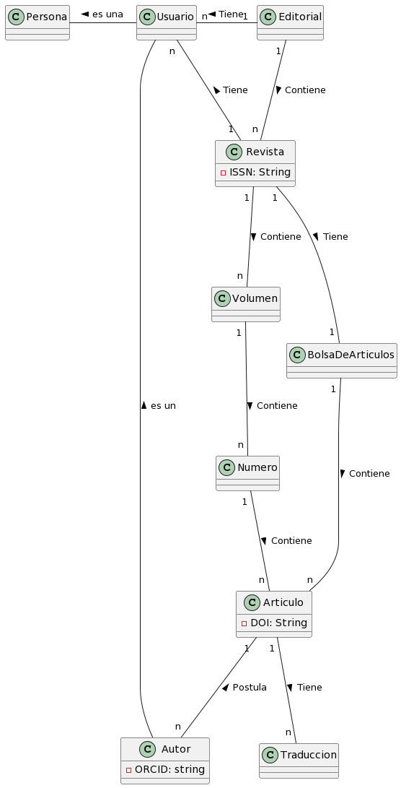
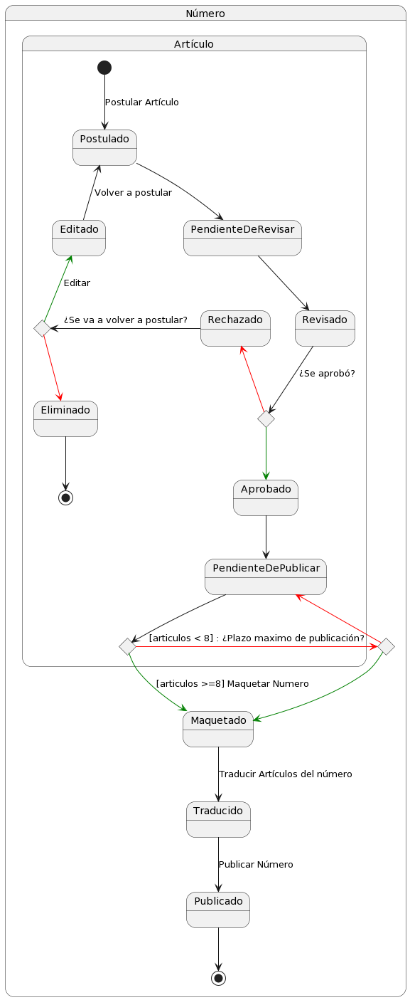
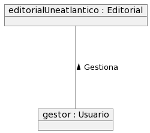
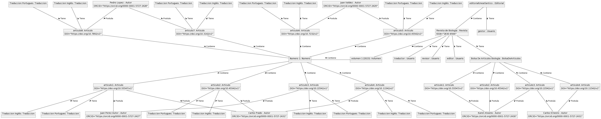

## Glosario
|                      | Descripción                                                                                                                                                |
| -------------------- | ---------------------------------------------------------------------------------------------------------------------------------------------------------- |
| **Persona**          | Individuo que accede a la plataforma.                                                                                                                      |
| **Usuario**          | Persona registrada con cualquier tipo de rol de los permitidos por el programa; sea autor, editor, gestor, traductor o revisor.                            |
| **Editorial**        | El programa en sí mismo, en él se interactúa con el producto, en este caso las revistas, tanto como para consumirlo como para crearlo, modificarlo y demás.|
| **Revista**          | Producto final ofrecido al consumidor, se compone de volúmenes y artículos y se reparte en números (normalmente dos).                                      |
| **Volumen**          | Divide la revista por años, conformados por uno o dos números cuando más.                                                                                  |
| **Numero**           | Cada sección de un volumen de la revista ofrecida a los usuarios, normalmente dos anuales.                                                                 |
| **Articulo**         | Conforman los números, pueden ser de temas diferentes pero con una temática general entre ellos.                                                           |
| **BolsaDeArticulos** | Es el lugar donde se almacenan todos los artículos que se encuentran aprobados y pendientes de agregar a un número                                         |
| **Autor**            | Usuario que postula un artículo para su publicación.                                                                                                       |
| **Traducción**       | Es una versión de un artículo en otro idioma                                                                                                               |

## Diagramas

  
Diagrama de clases

  
|         Diagrama de clases         
| :-: 
|  

  
Diagrama de estados

  

| Estado                              | Descripción                                                                                           |
| ----------------------------------- | ----------------------------------------------------------------------------------------------------- |
| **Artículo Postulado**              | El alumno esta matriculado en el máster                                                               |
| **Artículo Pendiente de Revisar**   | El alumno toma el curso mientras pasa el tiempo                                                       |
| **Artículo Revisado**               | Alumno con baja interacción y compromiso                                                              |
| **Artículo Aprobado**               | Alumno con alta interacción y compromiso                                                              |
| **Artículo Rechazado**              | Alumno deja la institución                                                                            |
| **Artículo editado**                | Sistema solicitando datos de alumnos                                                                  |
| **Artículo Eliminado**              | Sistema procesando los datos de los alumnos                                                              |
| **Artículo Pendiente de Publicar**  | Sistema interpretando los datos procesados y agrupándolos en clústers                                    |
| **Número Maquetado**                | Sistema realizando acciones para que el alumno no abandone, esto también puede realizarse fuera del sistema |
| **Número Traducido**                | Sistema realizando acciones para que el alumno no abandone, esto también puede realizarse fuera del sistema |

  
| Diagrama de estados Publicación de un número
| :-: 
| 

  
Diagrama de objetos Estado Inicial

  
|Diagrama de objetos Estado Inicial
|:-:
|

  
Diagrama de objetos Estado Avanzado

  
|Diagrama de objetos Estado Avanzado
|:-:
|

[Atrás](../readme.md)