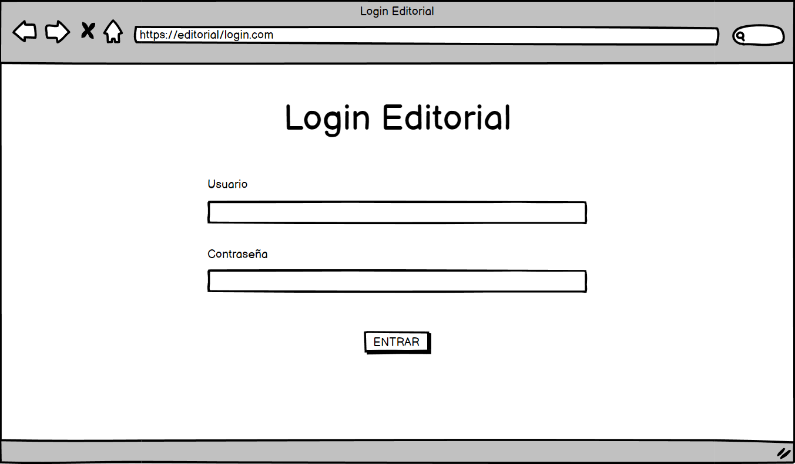
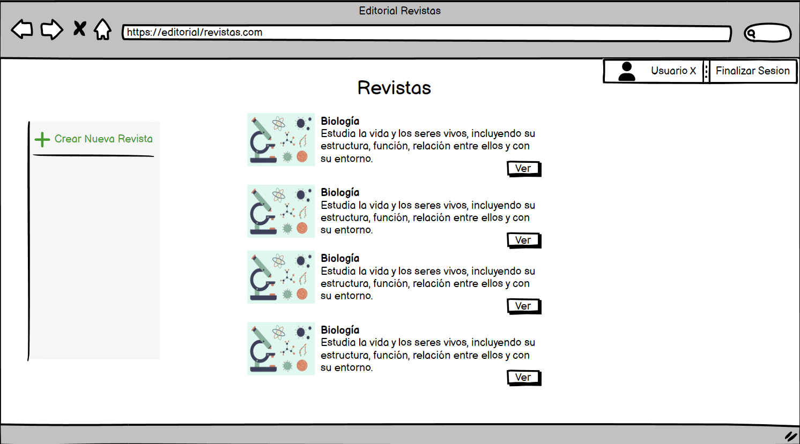
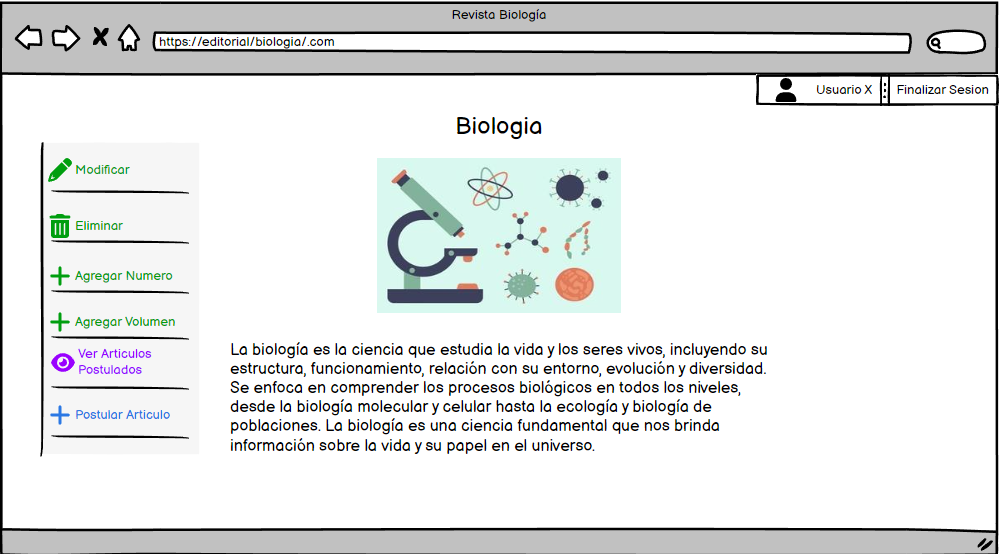
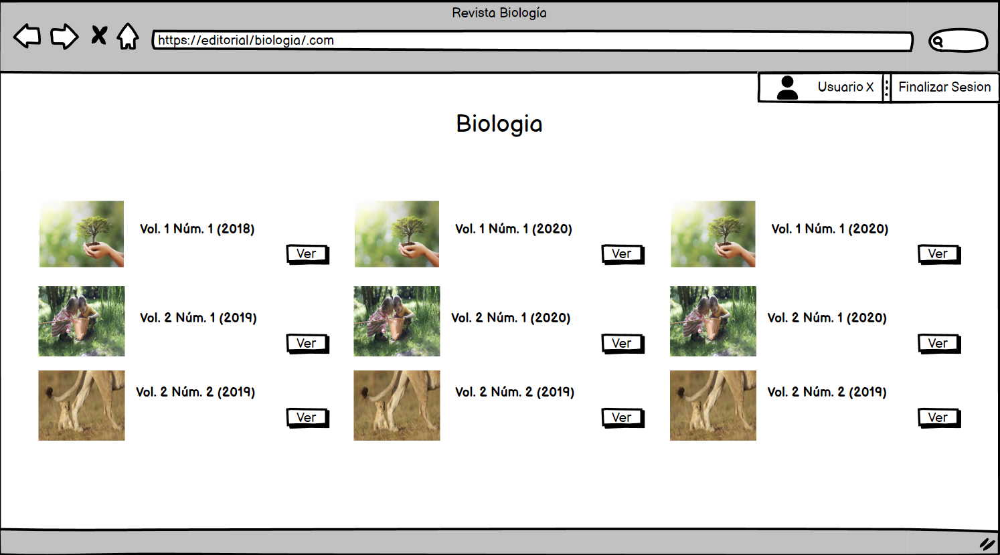
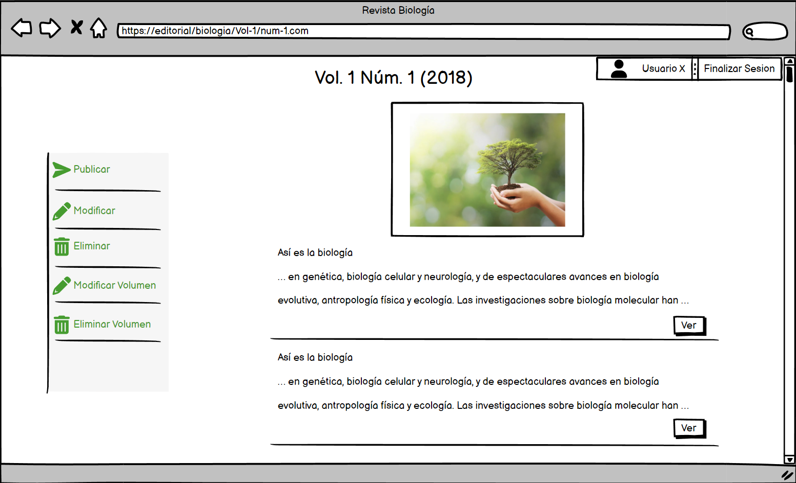
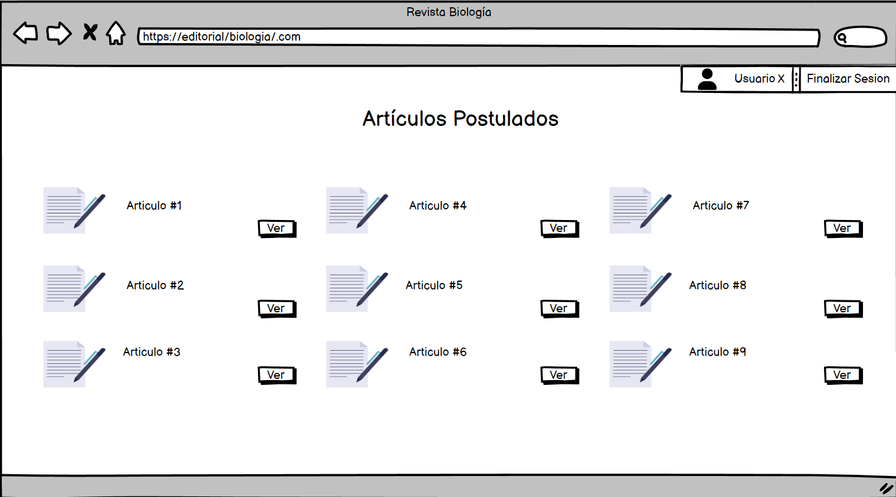
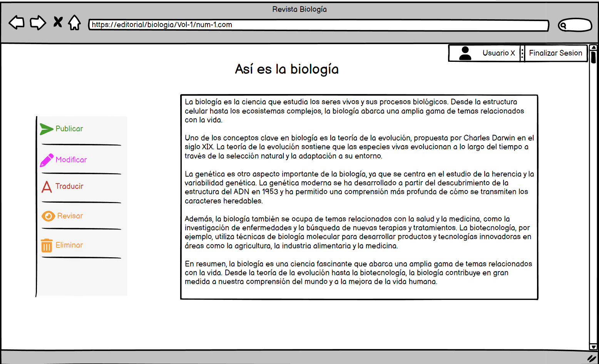

# Prototipo de Interfaz

## Prototipos

Las vistas que se detallan son genéricas y muestran todas las opciones disponibles para cualquier usuario con cualquier tipo de rol.
<ul>
    <li>Las opciones de color verde son las que se encuentran disponibles para el rol de gestor unicamente.
    <li>Las opciones de color azul son las que se encuentran disponibles para el rol de autor unicamente.
    <li>Las opciones de color violeta son las que se encuentran disponibles para cualquier rol excepto para el de autor.
    <li>Las opciones de color rojo son las que se encuentran disponibles para el rol de traductor unicamente.
    <li>Las opciones de color naranja son las que se encuentran disponibles para el rol de revisor unicamente.
    <li>Las opciones de color rosa son las que se encuentran disponibles para el rol de revisor y gestor unicamente.
</ul>
 

    
Inicio

    
Panel Inicial

    
Vista Revista

    
Vista Listar Números

    
Vista Número

    
Vista Listar Articulos

    
Vista Artículo

## Relación Casos de Uso - Prototipos

[Atrás](../readme.md)