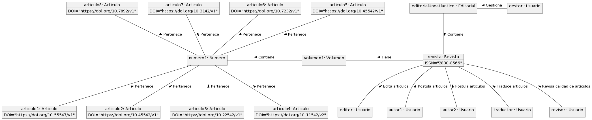
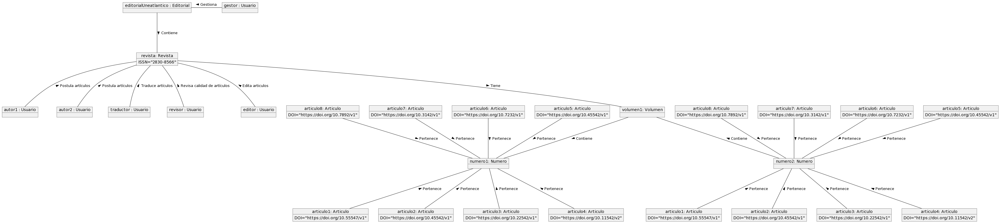

# Gestor de Revistas / Modelo del dominio

|Diagrama de clases|Diagrama de Estados|
|:-:|:-:|
||
|[Código](modeloDelDominio/modeloDelDominio.puml)|[Código](diagramaDeEstados/diagramaDeEstados.puml)
|Diagrama de Casos de Uso|Diagrama de Secuencia de Casos de Uso|
||
|[Código](casosDeUso/casosDeUso.puml)|[Código](secuenciaCasosDeUso/secuenciaCasosDeUso.puml)
|Diagrama de Objetos - Estado Inicial|Diagrama de Objetos - Estado Intermedio|
||
|[Código](objetosDelDominio/objetosDelDominio_EstadoInicial.puml)|[Código](objetosDelDominio/objetosDelDominio_EstadoIntermedio.puml)
|Diagrama de Objetos - Estado Avanzado|Diagrama de Flujo - Publicación de un Número|
||
|[Código](objetosDelDominio/objetosDelDominio_EstadoAvanzado.puml)|[Código](diagramaDeFlujo/diagramaDeFlujo.puml)
