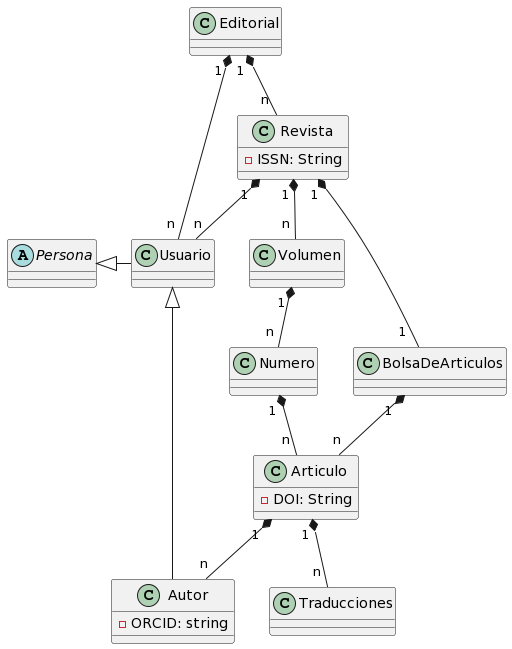
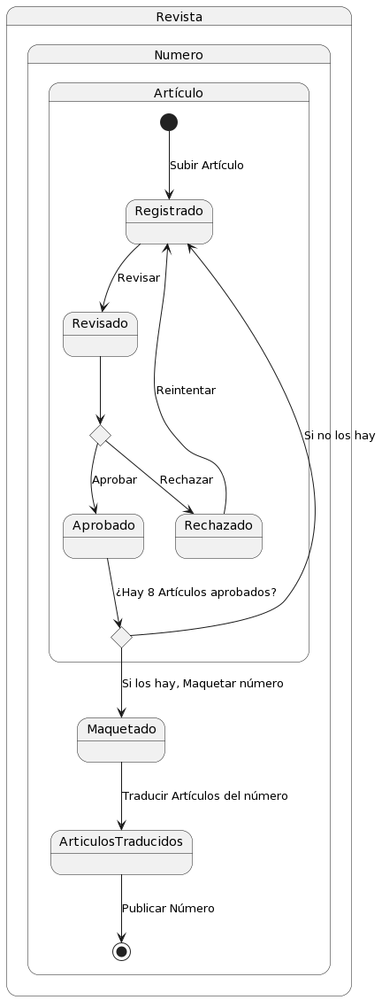
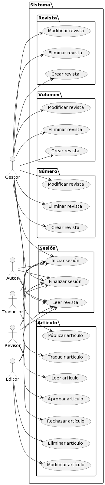
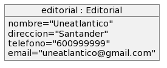

# Gestor de Revistas / Modelo del dominio

|Diagrama de clases|Diagrama de Estados|
|:-:|:-:|
||
|[Código](modeloDelDominio/modeloDelDominio.puml)|[Código](diagramaDeEstados/diagramaDeEstados.puml)
|Dagrama de Casos de Uso|Diagrama de Objetos - Estado Inicial|
||
|[Código](casosDeUso/casosDeUso.puml)|[Código](objetosDelDominio/objetosDelDominio_EstadoInicial.puml)

