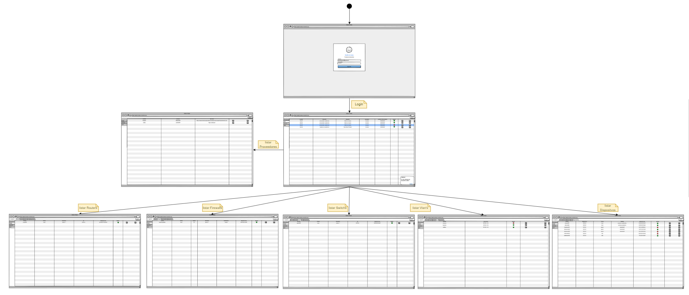

# Proyecto Ingeniería de Software

Repositorio para el proyecto de la asignatuea

## Rodrigo Zaldaña Calles (Cliente)

# Resumen

- Se desarrolla el modelo del dominio de una problemática propuesta por un cliente, la cual es, poder conocer el estado de un dispositivo conectado a una red, mediante una aplicación que sea capas de listar los dispositivos y las subredes en las que se encuentras estos y notificar al usuario cuando la red, las subredes y los dispositivos pierdan conexión.

# Introducción

- Gestionar la conexión de los dispositivos y VLans que componen una red perteneciente a una empresa u organización.

# Glosario

| Entidad     | Definición                                                                                                                                                                                                                |
| ----------- | ------------------------------------------------------------------------------------------------------------------------------------------------------------------------------------------------------------------------- |
| Usuario     | Todo aquel que interactúe con la aplicación, ya sea como administrador para gestionarla o como un usuario tecnico que desee ver información de las redes.                                                                 |
| Wan         | Es la entidad principal, es quien relaciona al resto de entidades. Una Wan se compone por proveedor, router, firewall, switch como elementos propios. Es gestionada por un usuario y los dispositivos se conectan a esta. |
| Ubicación   | Es el lugar físico en donde se encuentra la red.                                                                                                                                                                          |
| Router      | Dispositivo que provee a la red de conexión a internet también llamada Modem.                                                                                                                                             |
| Proveedor   | Compañía que presta el servicio de internet a la red se le puede conocer como "líniea fija" el cual tiene un número de referencia y un contrato.                                                                          |
| Firewall    | Dispositivo de seguridad que gestiona, es decir admite o no, el tráfico de información mediante la red e internet.                                                                                                        |
| Switch      | Es el dispositivo que reparte el tráfico de red a los dispositivos y que además crea VLans                                                                                                                                |
| VLan        | Son las redes locales en la cuales se dividen los dispositivos, dando ciertos accesos en la red a distintos dispositivos.                                                                                                 |
| Dispositivo | Hardware que al usuario le interesa conocer su estado, entre estos se encuentran: antenas, cámaras de vigilancia, lector de huellas, servidores, impresoras, teléfonos VoIP, Router y en casos muy puntuales móviles.     |

# Partes que componen una Red

- Proveedor
- Red
- Firewall
- Switch
- Dispositivos conectados

# Modelo de Dominio

|           Modelo de Dominio           |
| :-----------------------------------: |
|  |

# Diagrama de Objetos

|           Diagrama de Objetos           |
| :-------------------------------------: |
|  |

# Diagrama de Estados de una Notificación

- Diagrama de estados por las que pasa una Notificación

|                Diagrama de Estados                 |
| :------------------------------------------------: |
|  |

## Actores y Casos de Uso

# Actores

| Actor                 | Descripción                                    |
| --------------------- | ---------------------------------------------- |
| **Administrador**     | Gestiona redes, proveedores y usuarios         |
| **Técnicos internos** | Gestionan redes y proveedores                  |
| **Técnicos externos** | Ven redes                                      |
| **Tiempo**            | Notifica cuando la parte de una Red está caida |

# Casos de Uso

- Notificación:
  El sistema hace peticiones cada cierto tiempo a las partes de una Red para verificar su estado.
  Si un dispositivo está desconectado lanza una Notificación con la información del dispositivo

|                     |                        |
| ------------------- | ---------------------- |
| Nueva red           | Nuevo dispositivo      |
| Actualizar red      | Actualizar dispositivo |
| Eliminar red        | Eliminar dispositivo   |
| Listar redes        | Listar dispositivos    |
| Nuevo router        | Nuevo proveedor        |
| Actualizar router   | Actualizar proveedor   |
| Eliminar router     | Eliminar proveedor     |
| Listar routers      | Listar proveedores     |
| Nuevo firewall      | Nuevo usuario          |
| Actualizar firewall | Actualizar usuario     |
| Eliminar firewall   | Eliminar usuario       |
| Listar firewalls    | Listar usuarios        |
| Nuevo switch        | Perfil                 |
| Actualizar switch   | Notificación           |
| Eliminar switch     |
| Listar switchs      |
| Nueva vlan          |
| Actualizar vlan     |
| Eliminar vlan       |
| Listar vlanes       |

|           Casos de Uso           |
| :------------------------------: |
|  |

|          Casos de Uso Wan           |
| :---------------------------------: |
|  |

# Diagrama de Contexto

|           Diagrama de Contexto           |
| :--------------------------------------: |
|  |

# Prototipos de Interfaz de Usuario

|    Prototipo de Interfaz de Usuario     |
| :-------------------------------------: |
|  |
