# Proyecto Ingeniería de Software

Repositorio para el proyecto de la asignatuea

## Rodrigo Zaldaña Calles (Cliente)

# Descripción del Proyecto

- Se desarrolla el modelo del dominio de una problemática propuesta por un cliente, la cual es, poder conocer el estado de un dispositivo conectado a una red, mediante una aplicación que sea capas de listar los dispositivos y las subredes en las que se encuentras estos y notificar al usuario cuando la red, las subredes y los dispositivos pierdan conexión.

# Objetivo principal

- Gestionar la conexión de los dispositivos y VLans que componen una red perteneciente a una empresa u organización.

# Partes que componen una red

- Proveedor
- Red
- Firewall
- Switch
- Dispositivos conectados

# Requisitado Sesión 1

|   Partes que conforman una Red    |
| :-------------------------------: |
|  |

| Roles de Usuarios que se necesitan  |
| :---------------------------------: |
|  |

# Requisitado Sesión 2

|          Que es una red           |
| :-------------------------------: |
|  |

|  Definicion flujo de una red   |
| :----------------------------: |
|  |

# Diagramas

|           Modelo de Dominio           |
| :-----------------------------------: |
|  |

|           Diagrama de Objetos           |
| :-------------------------------------: |
|  |

|           Diagrama de Estados           |
| :-------------------------------------: |
|  |

|           Casos de Uso           |
| :------------------------------: |
|  |

## Actores

| Actor                 | Descripción                            |
| --------------------- | -------------------------------------- |
| **Administrador**     | Gestiona redes, proveedores y usuarios |
| **Técnicos internos** | Gestionan redes y proveedores          |
| **Técnicos externos** | Ven redes                              |

# Glosario

| Entidad     | Definición                                                                                                                                                                                                                |
| ----------- | ------------------------------------------------------------------------------------------------------------------------------------------------------------------------------------------------------------------------- |
| Usuario     | Todo aquel que interactúe con la aplicación, ya sea como administrador para gestionarla o como un usuario tecnico que desee ver información de las redes.                                                                 |
| Red         | Es la entidad principal, es quien relaciona al resto de entidades. Una red se compone por proveedor, router, firewall, switch como elementos propios. Es gestionada por un usuario y los dispositivos se conectan a esta. |
| Ubicación   | Es el lugar físico en donde se encuentra la red.                                                                                                                                                                          |
| Router      | Dispositivo que provee a la red de conexión a internet también llamada Modem.                                                                                                                                             |
| Proveedor   | Compañía que presta el servicio de internet a la red se le puede conocer como "líniea fija" el cual tiene un número de referencia y un contrato.                                                                          |
| Firewall    | Dispositivo de seguridad que gestiona, es decir admite o no, el tráfico de información mediante la red e internet.                                                                                                        |
| Switch      | Es el dispositivo que reparte el tráfico de red a los dispositivos y que además crea VLans                                                                                                                                |
| VLan        | Son las redes locales en la cuales se dividen los dispositivos, dando ciertos accesos en la red a distintos dispositivos.                                                                                                 |
| Dispositivo | Hardware que al usuario le interesa conocer su estado, entre estos se encuentran: antenas, cámaras de vigilancia, lector de huellas, servidores, impresoras, teléfonos VoIP, Router y en casos muy puntuales móviles.     |

# Mockups

|                  Inicio                  |
| :--------------------------------------: |
|      |
|  |

|            Listar Proveedores             |
| :---------------------------------------: |
| 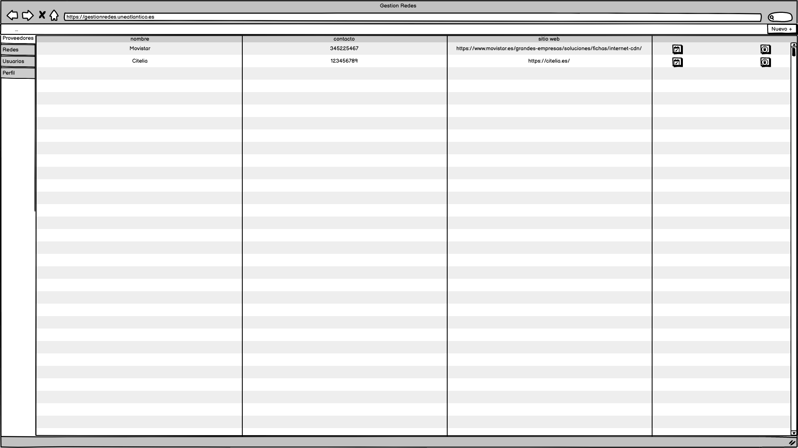 |

|            Crear Proveedor            |
| :-----------------------------------: |
| 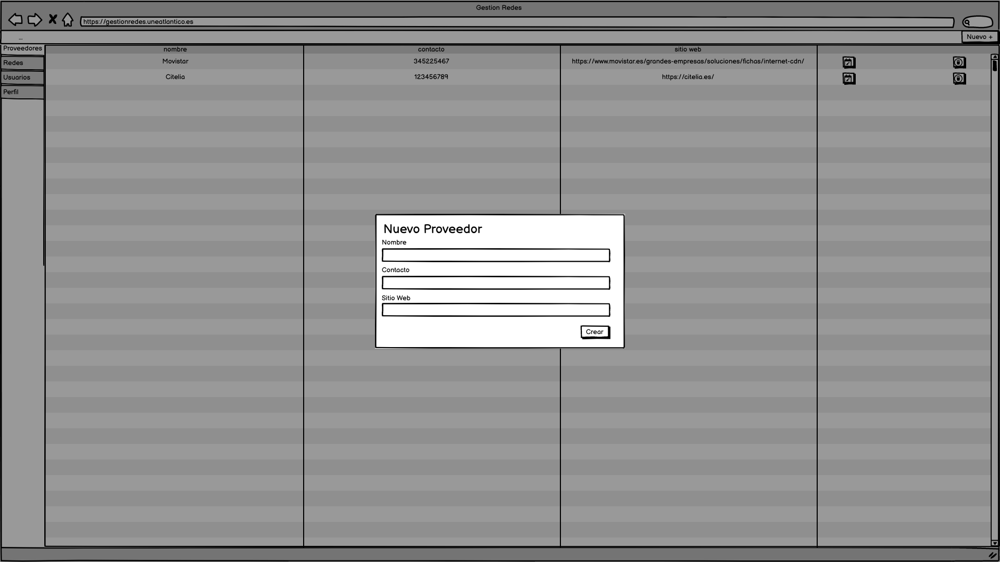 |

|            Listar Redes             |
| :---------------------------------: |
| 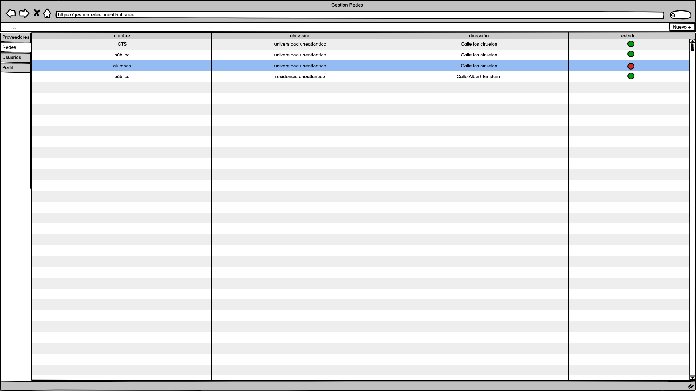 |

|             Routes de una Red             |
| :---------------------------------------: |
| 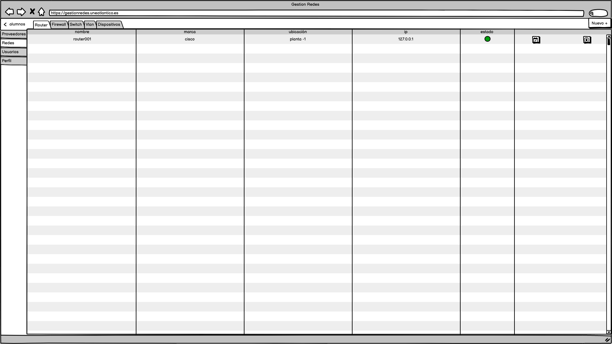 |

|             Firewall de una Red             |
| :-----------------------------------------: |
|  |

|             Switch de una Red             |
| :---------------------------------------: |
| 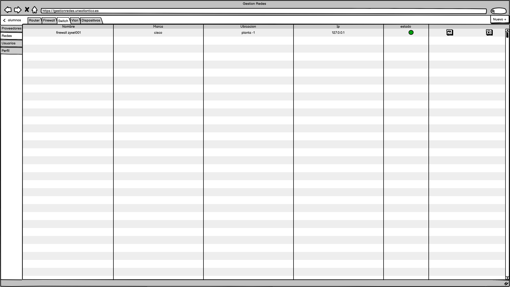 |

|             Vlan de una Red             |
| :-------------------------------------: |
| 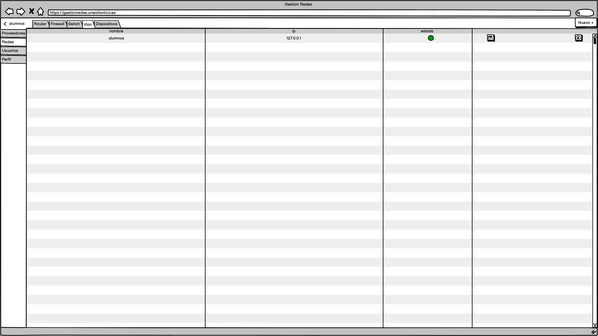 |

|             Dispositivos de una Red             |
| :---------------------------------------------: |
| 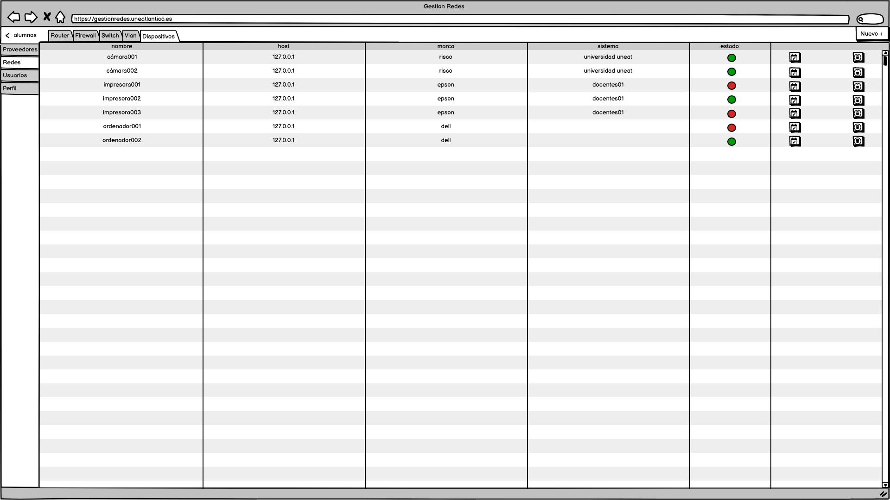 |

|          Crear una Red          |
| :-----------------------------: |
| 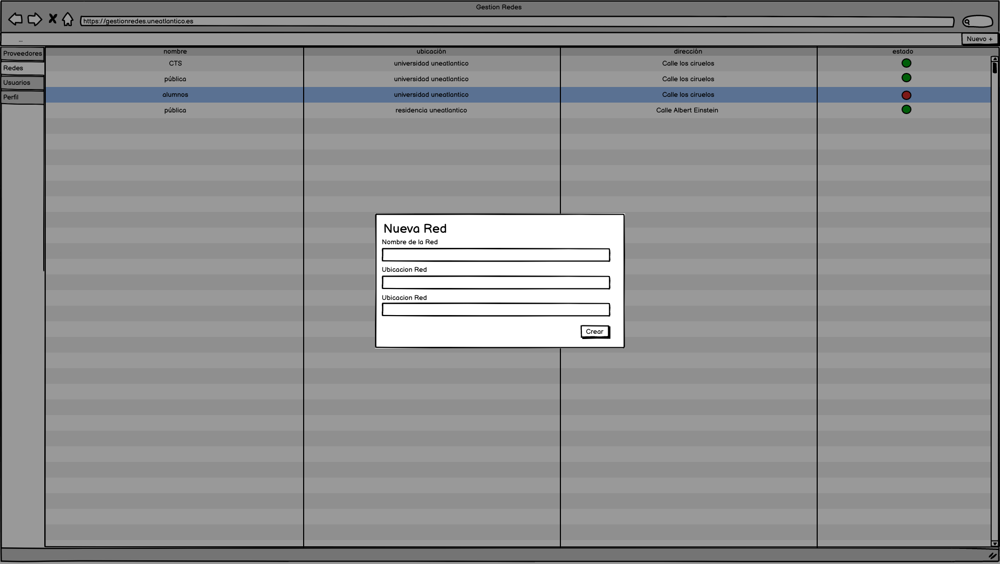 |

|                  Crear Router                  |
| :--------------------------------------------: |
| 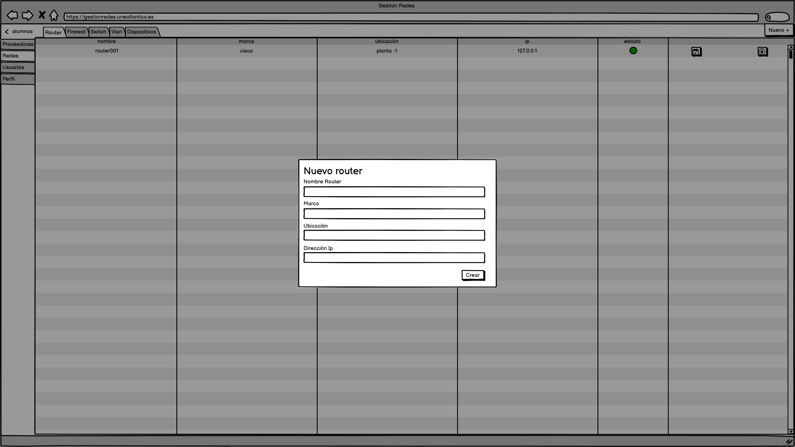 |

|                  Crear Firewall                  |
| :----------------------------------------------: |
| 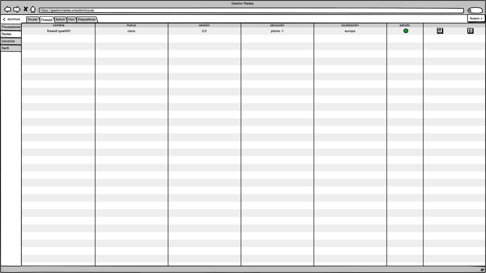 |

|                  Crear Switch                  |
| :--------------------------------------------: |
| 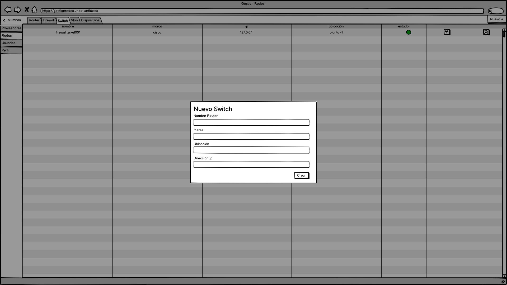 |

|                  Crear Vlan                  |
| :------------------------------------------: |
| 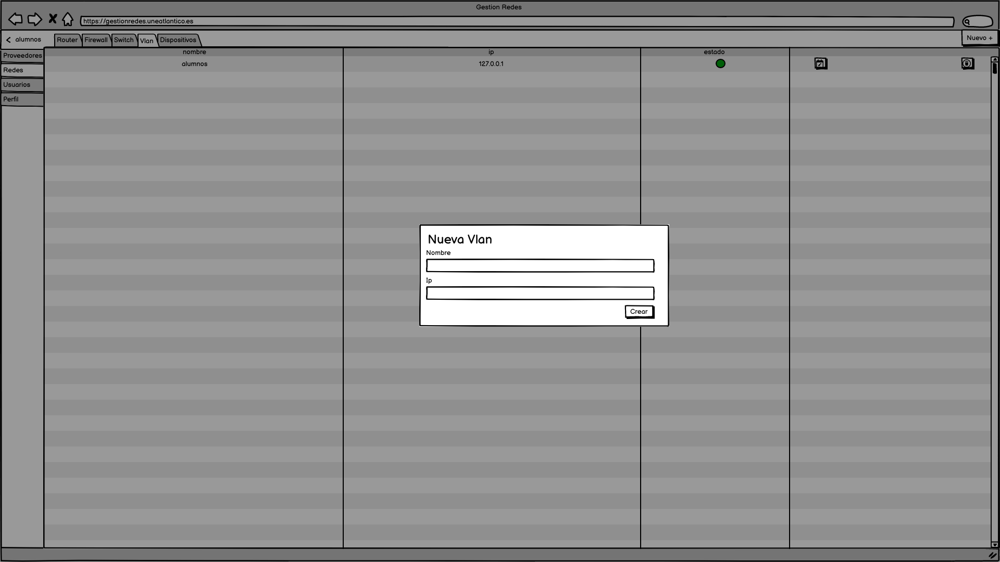 |

|                 Crear Dispositivos                  |
| :-------------------------------------------------: |
| 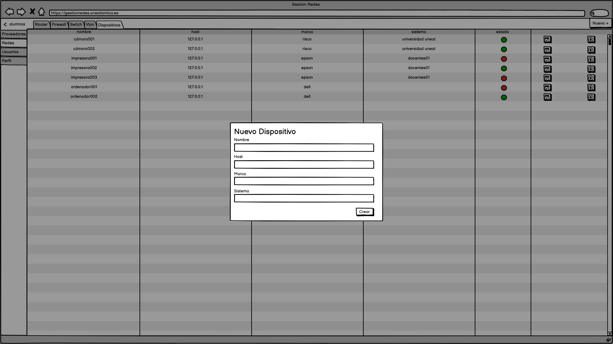 |

|            Listar Usuarios             |
| :------------------------------------: |
| 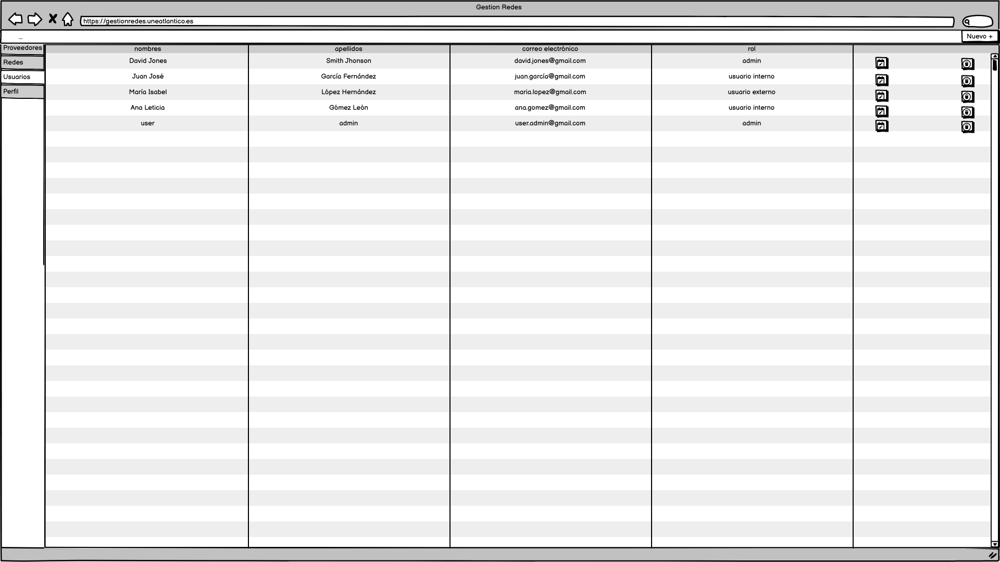 |

|            Crear Usuario            |
| :---------------------------------: |
| 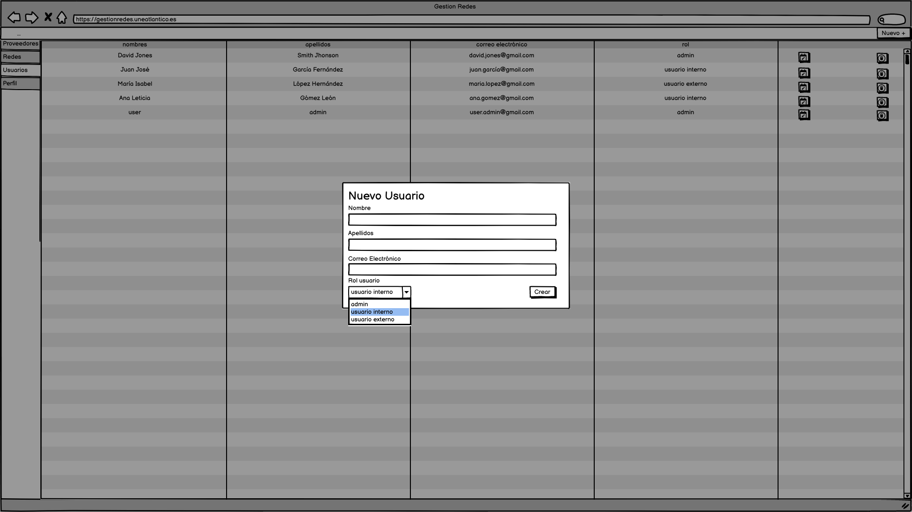 |

|          Perfil de Usuario           |
| :----------------------------------: |
| 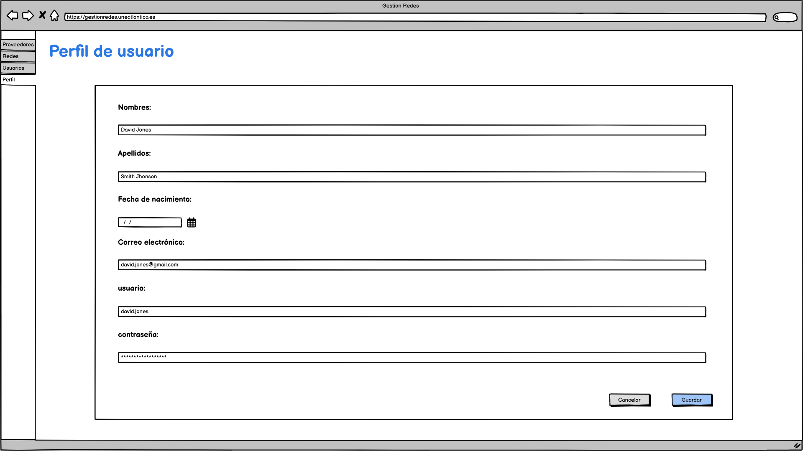 |
