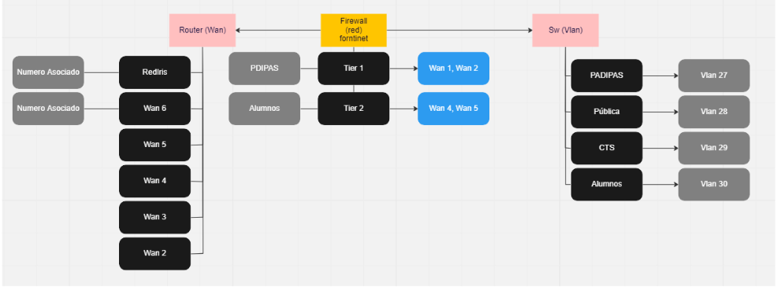
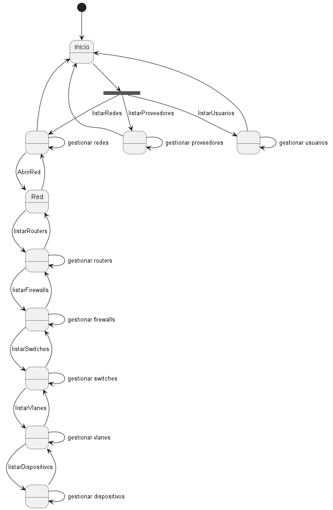

# Proyecto Ingeniería de Software

Repositorio para el proyecto de la asignatuea

## Rodrigo Zaldaña Calles (Cliente)

# Descripción del Proyecto

* El objetivo de ésta aplicación es el de gestionar redes, que permita ver el estado de las partes que componen una red y notificar al administrador si hay algún fallo.

* Las partes que componen una red son, proveedor, red, seguridad, switch y dispositivos

# Requisitado Sesión 1

|Partes que conforman una Red|
|:-:|
||

|Roles de Usuarios que se necesitan|
|:-:|
||

# Requisitado Sesión 2
|Que es una red|
|:-:|
||

|Definicion flujo de una red|
|:-:|
||

# Diagramas

|Modelo de Dominio|
|:-:|
||

|Diagrama de Objetos|
|:-:|
||

|Diagrama de Estados|
|:-:|
||

|Casos de Uso|
|:-:|
||

|Actores|

|Actor|Descripción|
|-|-|
|**Administrador**|Gestiona redes, proveedores y usuarios|
|**Técnicos internos**|Gestionan redes y proveedores|
|**Técnicos externos**|Ven redes|

# Glosario

- Usuario: Todo aquel que interactúe con la aplicación, ya sea como administrador para
gestionarla o como un usuario común que desee ver información de las redes.

- Red: Es la entidad principal, es quien relaciona al resto de entidades. Una red tiene proveedor, router, firewall, switch como elementos propios. Es gestionada por un usuario y los dispositivos se conectan a esta.

- Ubicación: Es el lugar físico en donde se encuentra la red.

- Router: Dispositivo que provee a la red de conexión a internet.

- Proveedor: Compañía que presta el servicio de internet a la red.

- Firewall: Dispositivo de seguridad que gestiona, es decir admite o no, el tráfico de información mediante la red e internet.

- Switch: Es el dispositivo que reparte el tráfico de red a los dispositivos y que además crea VLans

- VLan: Son las redes locales en la cuales se dividen los dispositivos, dando ciertos accesos en la red a distintos dispositivos.

- Dispositivo: Todo aquel hardware que sea capaz de recibir información mediante una red inalambrica o alambrica

# Mockups

|Mockup Vista Dashboard|
|:-:|
||
