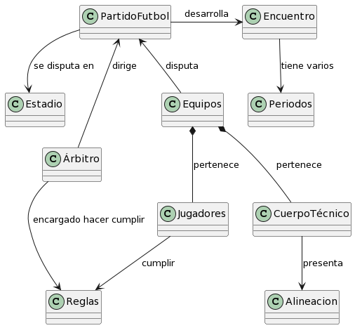
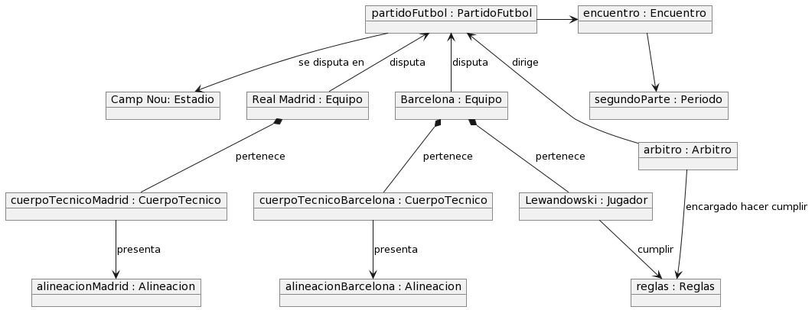

# Fútbol / Modelo del dominio

|Diagrama de clases|Diagrama de Estados|
|:-:|:-:|
||
|[Código](CódigosUML/diagramaClases.puml)|[Código](CódigosUML/diagramaEstados.puml)

|Diagrama de objetos
|:-:
|
|[Código](CódigosUML/diagramaObjetos.puml)
