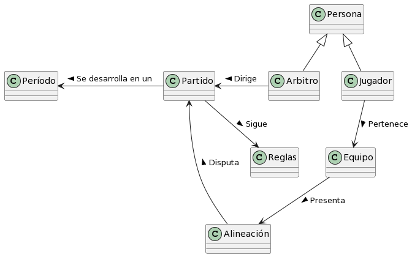
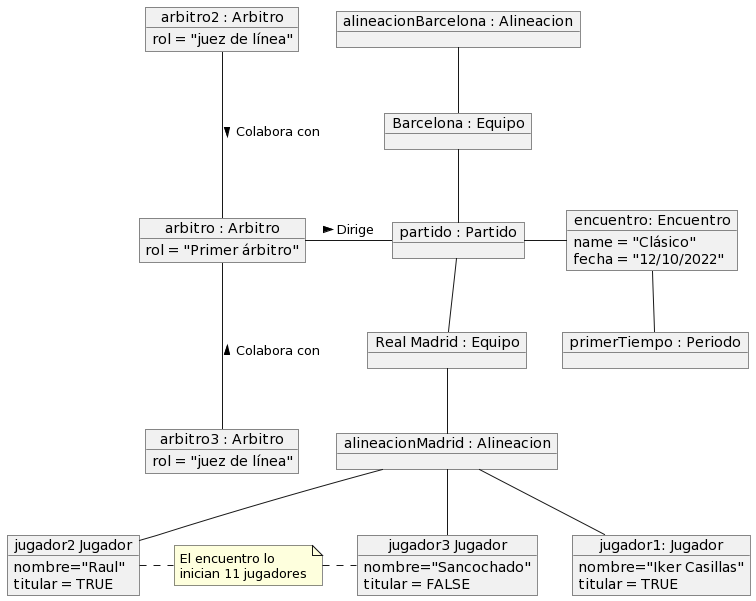

# Fútbol / Modelo del dominio

|Diagrama de clases|Diagrama de Estados|
|:-:|:-:|
||
|[Código](modeloDelDominio.puml)|[Código](diagramaDeEstados.puml)

|Diagrama de objetos
|:-:
|
|[Código](objetosDelDominio_EstadoInicial.puml)
