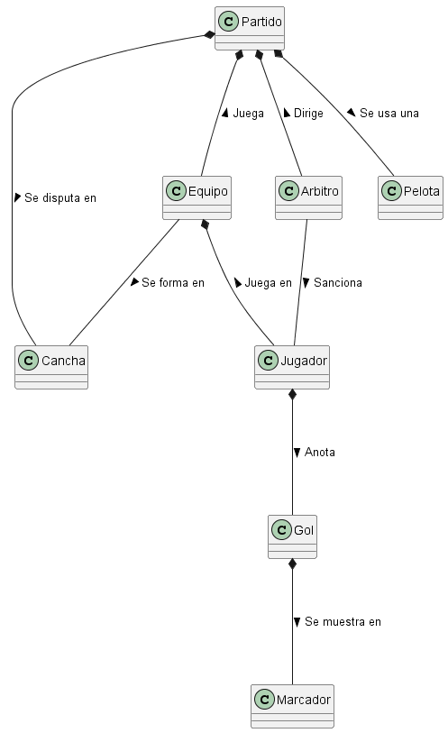
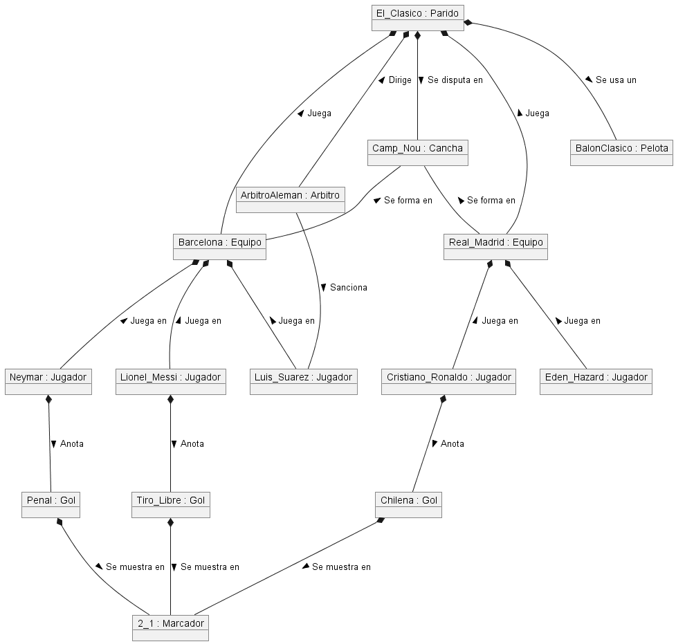
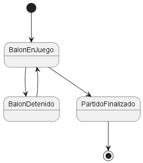

# Fútbol / Modelo del dominio

|Diagrama de clases|Diagrama de objetos|Diagrama de estados|
|:-:|:-:|:-:|
||||
|[Código](FootballClasses.puml)|[Código](FootballObjects.puml)|[Código](FootballStates.puml)|