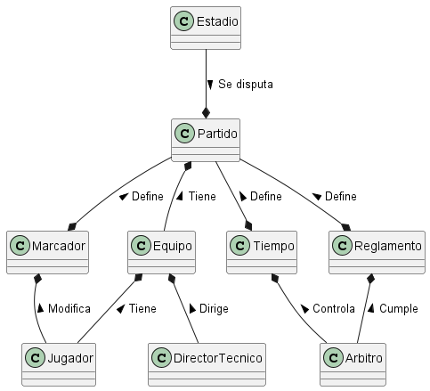

# Modelo del dominio de un **partido de fútbol**

Vamos a ir poniendo aquí los trabajos. Creamos cada uno (en esta carpeta) una carpeta llamada apellidosNombre y dentro de ella nuestros avances

Nos basamos en las [reglas que están recogidas en la wikipedia](https://es.wikipedia.org/wiki/F%C3%BAtbol#Las_reglas_del_juego).

De acuerdo a la [estrategia de trabajo planteada](../), trabajen en su repo, y cuando quieran enviar algún avance, el pull request lo hacen a su propia rama, que sigue la nomenclatura de ApellidoNombre

Les animo a generar discusiones en la [sección de issues](https://github.com/mmasias/IdSw1-22-23/issues) de este repo

## Artefactos del modelo del dominio

|Diagrama de Clases|
|:-:|
||
|[Código del diagrama](ixcopalJuan/modelo-dominio/ModeloDominio.plantuml)|

* Diagrama(s) de objetos
* Diagrama de estados

## Glosario

* **Estadio**: Lugar en donde se disputa un partido de futbol.
* **Partido**: Hecho que sucede cuando dos equipos juegan futbol.
* **Marcador**: Cantidad de goles anotados por dos equipos en un encuentro de futbol.
* **Equipo**: Grupo de personas conformadas por Jugadores, Director Técico, entre otros.
* **Tiempo**: Período determinado en el que se disputa un partido de futbol.
* **Reglamento**: Conjunto de reglas que rigen el fútbol o balompié en todo el mundo.
* **Jugador**: Persona que pertenece a un equipo de futbol y cuenta con un dorsal dentro del equipo.
* **Director Técnico**: Es la persona encargada del entrenamiento físico, mental y técnico de un equipo de futbol.
* **Arbitro**: Persona encargada de que se cumplan las reglas del juego durante el transcurso de un partido.