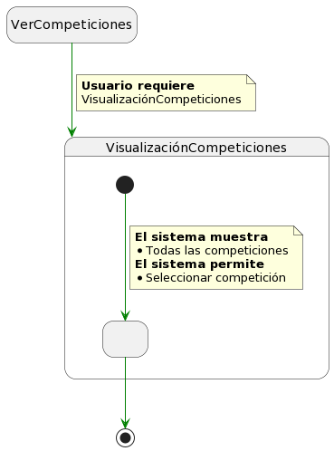
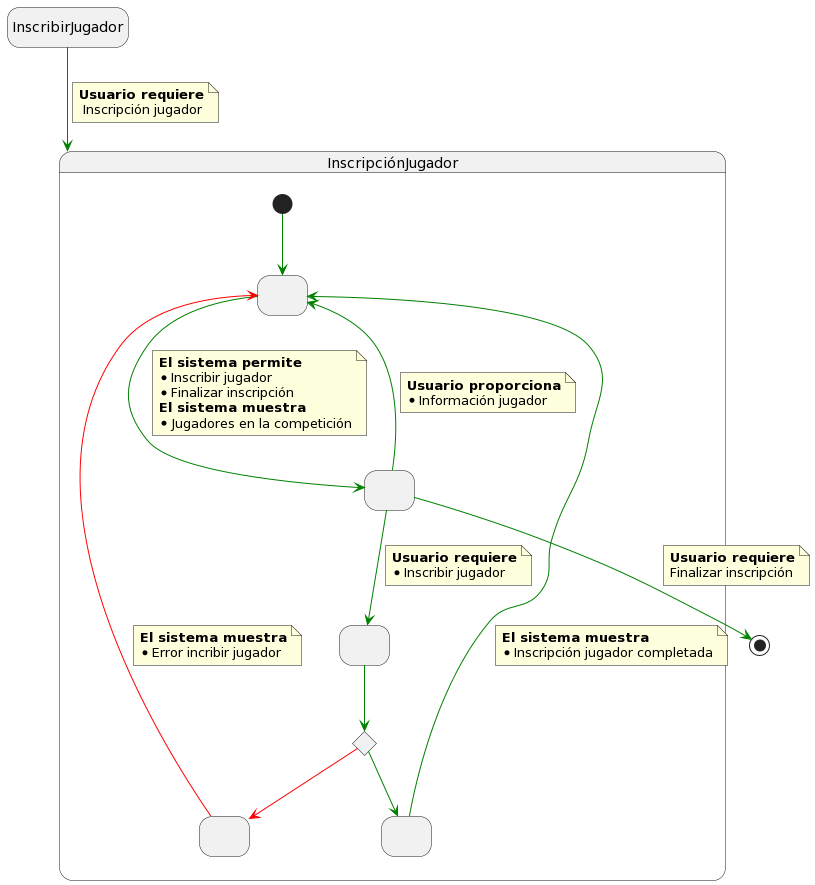
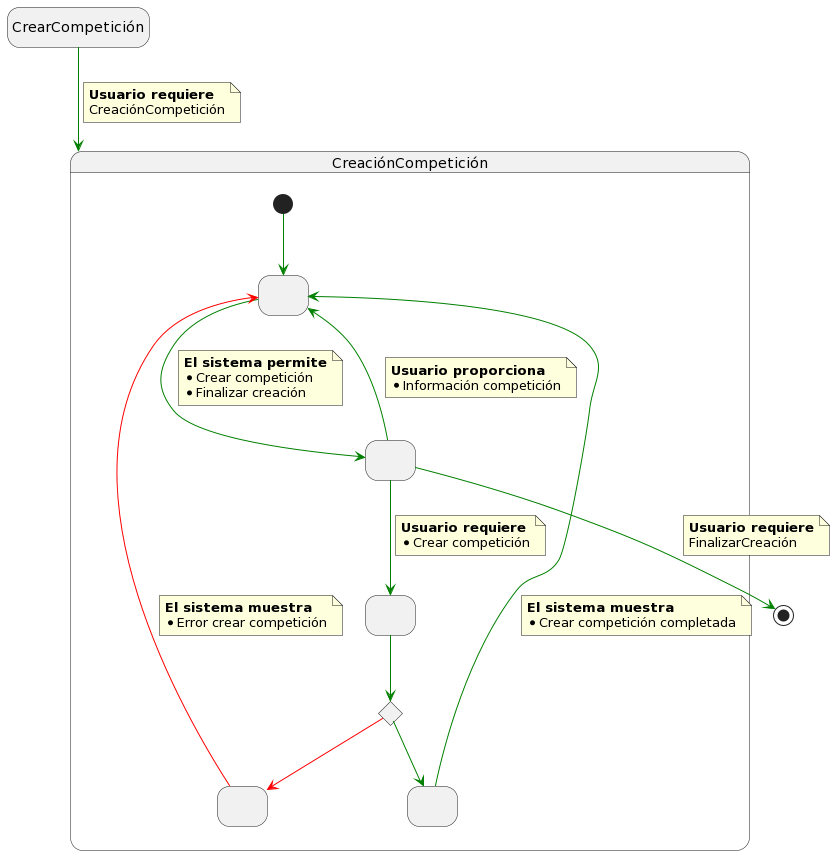
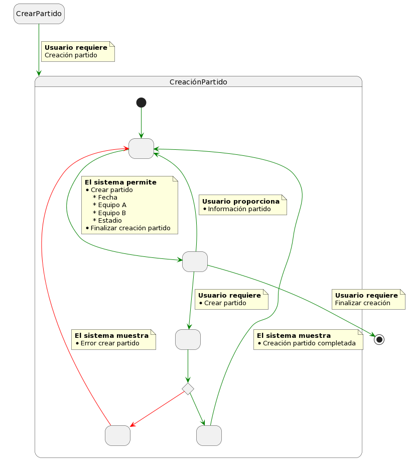
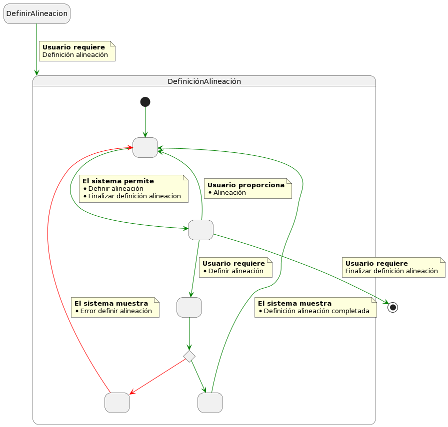
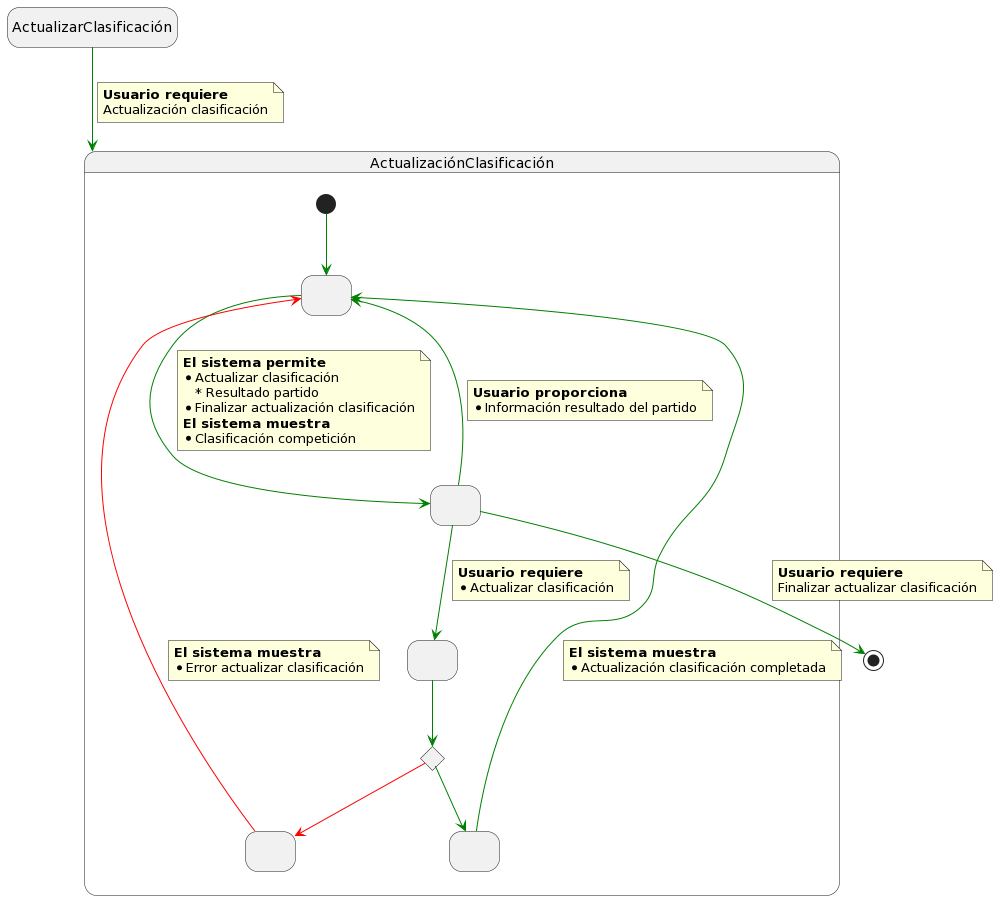
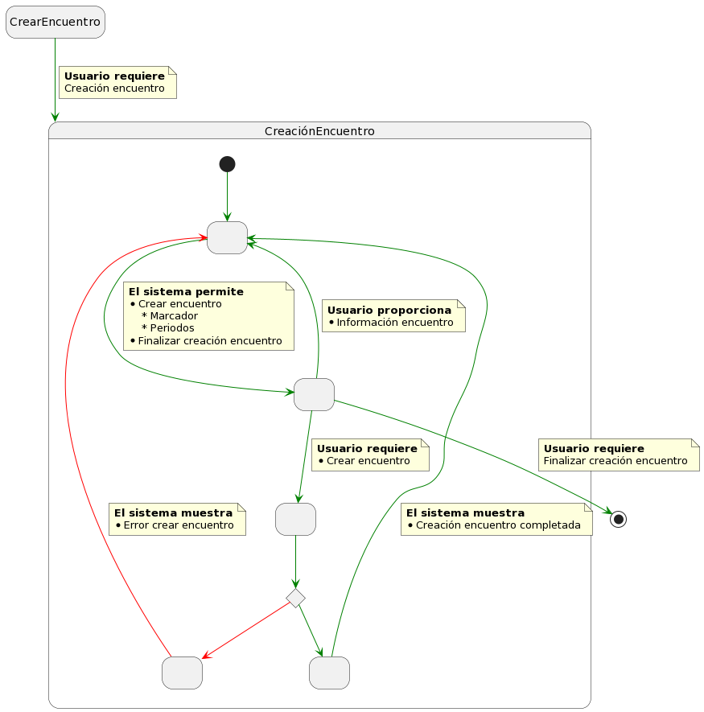
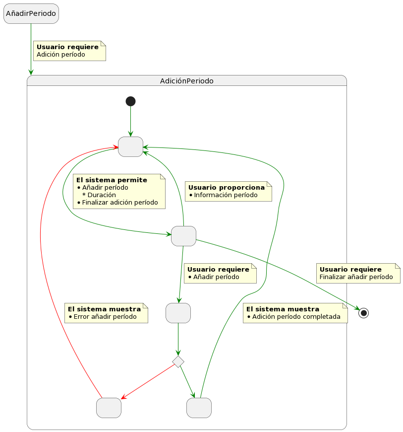
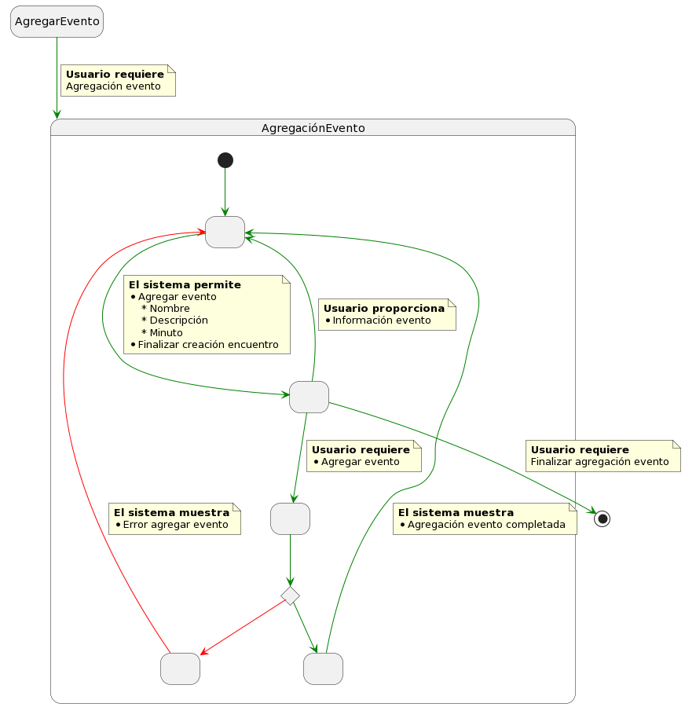

## Detalle Casos de Uso

  
Ver Competiciones

|VerCompeticiones
|:-:
|
|[Código](Códigos/VerCompeticiones.puml)
  

  

  
Inscribir Jugador

|InscribirJugador
|:-:
|
|[Código](Códigos/InscribirJugador.puml)

  
Inscribir Equipo

|InscribirEquipo
|:-:
|
|[Código](Códigos/InscribirEquipo.puml)

      

  
Crear Competición

|CrearCompetición
|:-:
|
|[Código](Códigos/CrearCompetición.puml)

  
Crear Partido

|CrearPartido
|:-:
|
|[Código](Códigos/CrearPartido.puml)
  

  

  
Definir Alineación

|DefinirAlineación
|:-:
|
|[Código](Códigos/DefinirAlineación.puml)

  
Actualizar Clasificación

|ActualizarClasificación
|:-:
|
|[Código](Códigos/ActualizarClasificación.puml)

      

  
Crear Encuentro

|CrearEncuentro
|:-:
|
|[Código](Códigos/CrearEncuentro.puml)

  
Añadir Período

|AñadirPeríodo
|:-:
|
|[Código](Códigos/AñadirPeríodo.puml)

      

  
Agregar Evento

|AgregarEvento
|:-:
|
|[Código](Códigos/AgregarEvento.puml)

