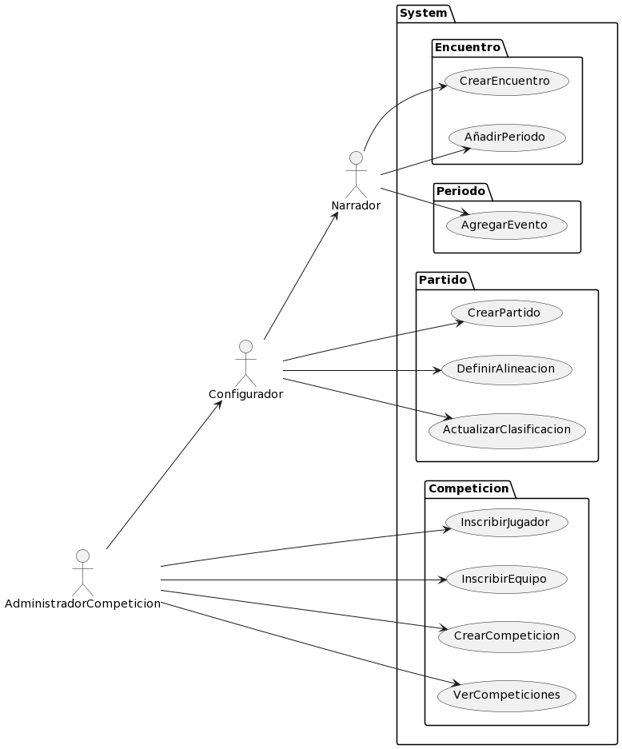
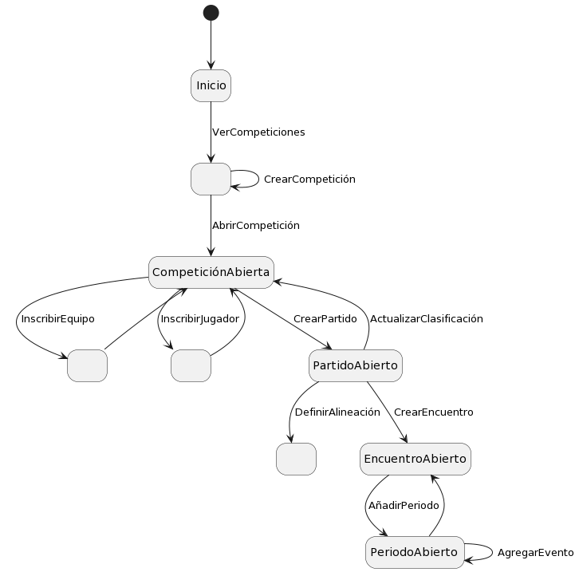

# Actores y Casos de uso

## Actores

|Actor|Descripción
|-|-
|**AdministradorCompeticion**|Configura la competición
|**Configurador**|Prepara el partido y actualiza la competición según el resultado de este
|**Narrador**|Encargado de ingresar los eventos del partido
|**Observador**|Observa el seguimiento del partido

## Casos de Uso

|Casos de Uso
|:-:
|
|[Código](CódigosUML/CasosDeUso.puml)

## Diagrama de contexto

|Diagrama de contexto
|:-:
|
|[Código](DiagramaContexto/CasosDeUso.puml)

