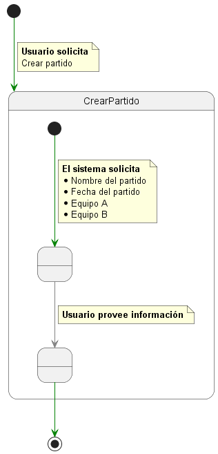
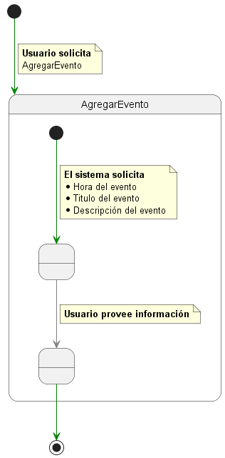
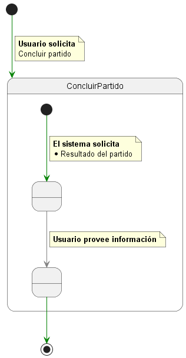
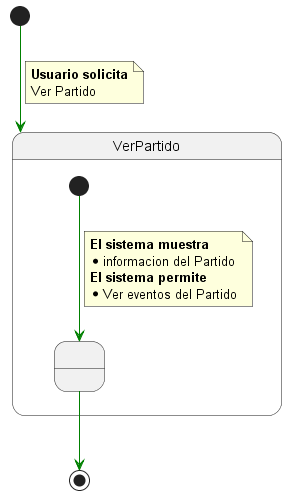
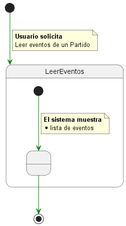
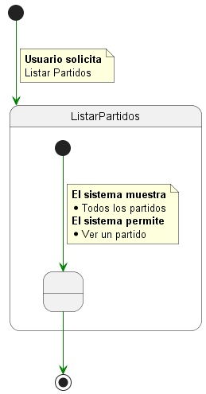

# App Fútbol

## Actores 

| User  | Admin                                                        |
| ----- | ------------------------------------------------------------ |
| User  | Persona que solo consume la informacion de los partidos      |
| Admin | Usuario que crea partidos y registra su informacion en ellos |

## Casos de uso
  

## Prioridad y Detalle

 

  
Crear Partido

|Crear Partido
|:-:
|

  
Agregar evento

|Agregar evento
|:-:
|

  
Concluir partido

|Concluir partido
|:-:
|

  
Ver partido

|Ver partido
|:-:
|

  
Leer eventos del partido

|Leer eventos del partido
|:-:
|

  
Listar partidos

|Listar partidos
|:-:
|

  
Login

|Login
|:-:
|

## Contexto

