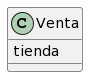
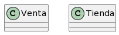

# Mis apuntes extra sobre Modelo del Dominio

Modelo del dominio [en la wikipedia](https://es.wikipedia.org/wiki/Modelo_de_dominio)

* Conjunto de clases conceptuales significativas del mundo real, no de componentes de software.
* Fuente de inspiración para el diseño de los objetos software.
* No son diagramas de clases u objetos de software con responsabilidades.

## Modelos del dominio

Objetivo: descomponer un dominio de interés en clases conceptuales u objetos (cosas de las que somos conscientes).

Modelo del dominio = Objetos + Atributos + Asociaciones

Modelo del dominio: diccionario **visual** de abstracciones

Modelo del dominio no son componentes de software: no ventanas, no BBDD, no responsabilidades (de software), no métodos.

### Clase conceptual

- Informalmente: una idea, una cosa o un objeto.
- Formalmente: Se puede considerar en términos de su símbolo, intensión y extensión.
  - Símbolo: palabras que representan una clase conceptual.
  - Intensión: definición de la clase conceptual.
  - Extensión: ejemplos a los que se aplica la clase.

### Descomposición

- Divide y vencerás
- En análisis estructurado se divide por funciones
- En análisis orientado a objetos dividimos por cosas o entidades.

> La principal tarea del análisis es identificar diferentes conceptos en el dominio del problema y documentar el resultado en un modelo del dominio.

### Somos iterativos

- El modelo del dominio se construye incrementalmente a lo largo de varias iteraciones en la fase de elaboración.

> Es mejor especificar en exceso un modelo del dominio con muchas clases conceptuales de grano fino que especificar por defecto.

- Es normal obviar clases y descubrirlas más tarde.

### No existe una lista "correcta"

- Puesto que es una colección algo arbitraria de abstracciones que el modelador considera relevantes.

## Guía

### Cómo hacerlo

1. Liste clases conceptuales candidatas (¿Cómo hallarlas? [Diapo 9 y siguientes](https://docs.google.com/presentation/d/1TB9XLKyaiJmMGd5clk7iW9Q363hRzRol7QXtb-Jp9eM/edit#slide=id.gf8ca7363e4_0_0))
1. Represéntelos en un diagrama
1. Asocie
1. Añada atributos

#### Error común

Representar algo como atributo cuando debería ser un concepto. Por tanto:

> Si no consideramos algo X como un número o texto, probablemente X sea una clase conceptual

|Opción 1 | | Opción 2 
|-|-|-|
||¿o ...?|

En el mundo real una tienda no se considera un número o texto, sino que el término sugiere una entidad real, una organización. Por tanto, Tienda debe ser un concepto.

## Asociaciones

Una asociación es una relación entre tipos (o instancias de esos tipos) que indica alguna conexión significativa e interesante.